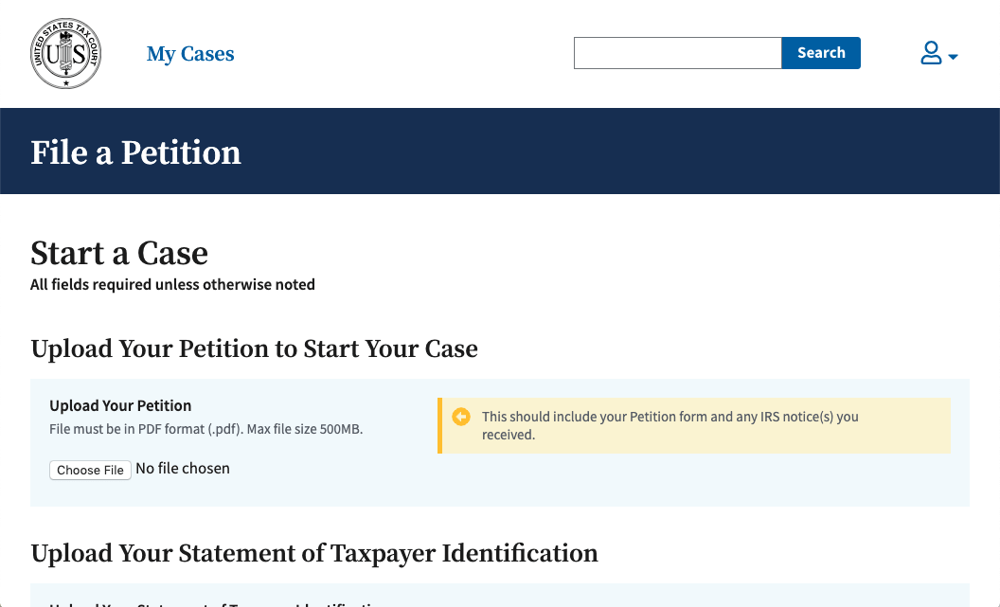
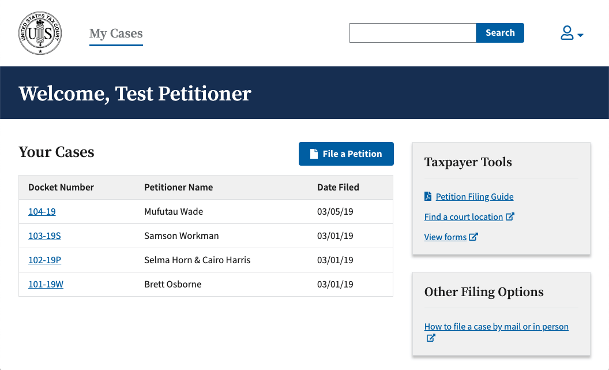
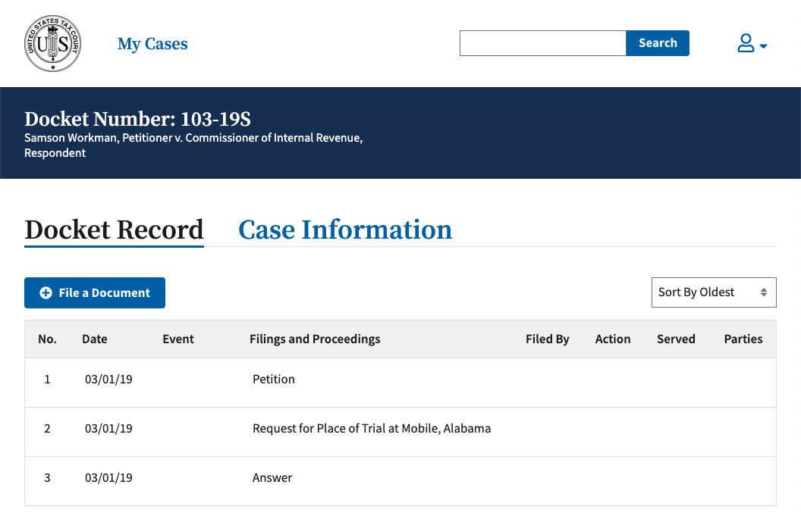
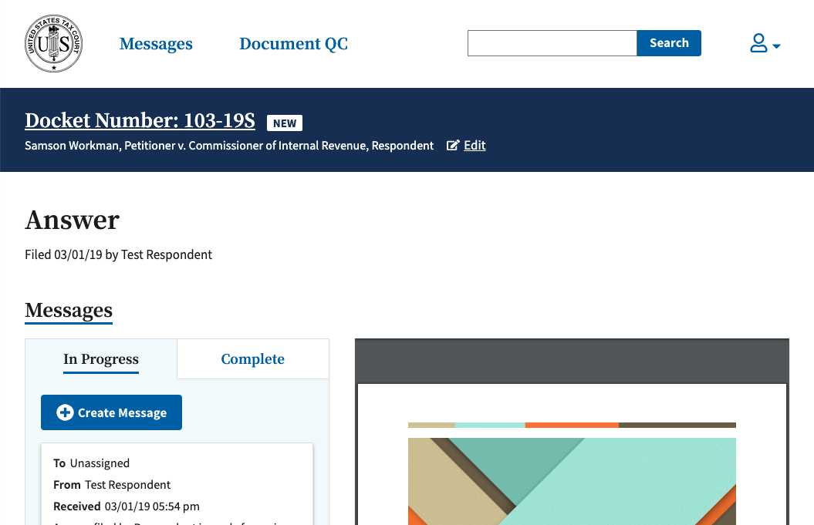

# Electronic Filing / Case Management System

### Build Status

#### develop

[](https://circleci.com/gh/flexion/ef-cms/tree/develop)

#### staging

[](https://circleci.com/gh/ustaxcourt/ef-cms/tree/staging)

API | Front-End | Shared Code
--- | --------- | -----------
[](https://sonarcloud.io/dashboard?id=ef-cms-api)<br>[](https://sonarcloud.io/dashboard?id=ef-cms-api)<br>[](https://sonarcloud.io/dashboard?id=ef-cms-api)<br>[](https://snyk.io/test/github/ustaxcourt/ef-cms?targetFile=efcms-service%2Fpackage.json) | [](https://sonarcloud.io/dashboard?id=ef-cms-front-end)<br>[](https://sonarcloud.io/dashboard?id=ef-cms-front-end)<br>[](https://sonarcloud.io/dashboard?id=ef-cms-front-end)<br>[](https://snyk.io/test/github/ustaxcourt/ef-cms?targetFile=web-client%2Fpackage.json) | [](https://sonarcloud.io/dashboard?id=ef-cms-shared)<br>[](https://sonarcloud.io/dashboard?id=ef-cms-shared)<br>[](https://sonarcloud.io/dashboard?id=ef-cms-shared)<br>[](https://snyk.io/test/github/ustaxcourt/ef-cms?targetFile=shared%2Fpackage.json)

An as-yet-unnamed project by the [U.S. Tax Court](https://ustaxcourt.gov/), creating an open-source Electronic Filing / Case Management System (EF-CMS) — software that allows case documents to be filed with the court, and for the court to manage cases. Work is being done by [Flexion](https://www.flexion.us/), which began in October 2018. The output of the most recent biweekly sprint can be found [in the `staging` branch](https://github.com/ustaxcourt/ef-cms/tree/staging) of this repository, with daily work performed in [Flexion's fork of this repository](https://github.com/flexion/ef-cms/). For background, see [the RFQ to procure agile software development services](https://github.com/ustaxcourt/case-management-rfq), which was awarded to Flexion in September 2018.

<a href="docs/images/screenshot-new-petition.png"></a>
<a href="docs/images/screenshot-cases.png"></a>

<a href="docs/images/screenshot-docket-record.png"></a>
<a href="docs/images/screenshot-answer.png"></a>

The main fork of this project in which most development is occurring is located at [flexion ef-cms](https://github.com/flexion/ef-cms).
[Zenhub](https://www.zenhub.com/) can be used to view the project board to see the github issues.

Artifacts for on-going development such as designs, research data, user workflows etc. are located in the [wiki](https://github.com/flexion/ef-cms/wiki).

## Technical overview

This is a React-based Javascript application. It’s housed in a [monorepo](https://en.wikipedia.org/wiki/Monorepo) that contains the front end (`web-client/`) and the back end (`efcms-service/`), with a third project housing resources that are shared between the front and back ends (`shared/`). It’s architected for Amazon Web Services, with a strong reliance on [Lambda](https://aws.amazon.com/lambda/), scripted with Terraform. The project is heavily containerized, using Docker, and can be run locally, despite the serverless architecture. All CI/CD processes are found in `management/`. Deployment is done via CircleCI.

## Documentation

For documentation about the CI/CD setup, API, style guide, UX, code review, etc., see [docs/README.md](docs/README.md).

## AWS diagram

<a href="docs/images/aws-diagram.png"></a>

## Dependency Diagrams

Client:
<a href="docs/images/client-dependencies.png"></a>

Server:
<a href="docs/images/server-dependencies.png"></a>

## Backlog

The backlog is stored [in GitHub Issues in Flexion’s repository](https://github.com/flexion/ef-cms/issues), _not_ on this repository. Although they can be viewed like any other GitHub issues, they are managed on a scrum board that requires the [ZenHub browser plugin](https://www.zenhub.com/) to see.

## Building everything

To run the same checks that run in Jenkins (except SonarQube) locally, using Docker containers, run the following:

`./build-all.sh`

This will run the lint, Shellcheck, audit, build, test, Cypress, Cerebral tests, Pa11y, etc. over all the components.

## Running / verifing the project via Docker

Assuming you have Docker installed, the following command will spin up a Docker container with the UI, API, local S3, local Dynamo, etc. all running inside it:

`./docker-run.sh`

- You can access the UI at http://localhost:1234
- You can access the API at http://localhost:3000
- You can access the dynamodb shell at http://localhost:8000/shell
- You can access the dynamodb-admin ui at http://localhost:8001
- You can access s3 local at http://localhost:9000
- You can access the style guide at http://localhost:1234/style-guide

## Running this project locally without Docker

The EF-CMS is comprised of two components: the API and the UI. Both must be run in order to function.

### Prerequisites

- Node v10.15.3
- npm 6.4.1
- Ghostscript v9.23 (see Setup below)
- ClamAV 0.101.2 (see Setup below)

### Setup

Follow the installation prerequisites for Ghostscript4JS at https://www.npmjs.com/package/ghostscript4js#prerequisites
MacOS users can do the following:
- `brew install https://raw.githubusercontent.com/Homebrew/homebrew-core/e61385fb91ced20245d063f728401e9727293ce0/Formula/ghostscript.rb`
- `echo 'export GS4JS_HOME="/usr/local/lib"' >> ~/.bash_profile`
- `source ~/.bash_profile`

For ClamAV, MacOS users can do the following:
- `brew install clamav`
- `cp /usr/local/etc/clamav/freshclam.conf.sample /usr/local/etc/clamav/freshclam.conf`
- `sed -ie 's/^Example/#Example/g' /usr/local/etc/clamav/freshclam.conf` (comments out `Example` in the `freshclam.conf` file)
- `echo 'export CLAMAV_CLAMSCAN_PATH="/usr/local/bin/clamscan"' >> ~/.bash_profile`
- `source ~/.bash_profile`
- `freshclam` (installs virus definitions)

Both the web-client and efcms-service share code that exists in the `shared` directory; therefore, before you can run either, you need to run `npm install` inside the `shared` directory.

- `cd shared && npm i`
- `cd ../web-client && npm i`
- `cd ../efcms-service && npm i`

#### Terminal A

- `cd web-client && npm start`

#### Terminal B

- `cd efcms-service && npm start`

## Login and Test Users

There are two login mechanisms available — the legacy mock login system, and a new one that emulates AWS Cognito.

## Mock Login

You can log in using these usernames:

```
taxpayer
petitionsclerk
docketclerk
respondent
seniorattorney
```

No password is required.

## AWS Cognito

To run use Cognito, start the web client with `npm run dev:cognito` (instead of `npm start`) You can then log in with:

```
petitioner1@example.com – petitioner5@example.com
petitionsclerk1@example.com – petitionsclerk5@example.com
docketclerk1@example.com – docketclerk5@example.com
respondent1@example.com – respondent5@example.com
seniorattorney1@example.com – seniorattorney5@example.com
```

The password for all accounts is:

`Testing1234$`

## Editor configuration

### Atom.io

Install the following for best results:

- https://atom.io/packages/language-javascript-jsx
- https://atom.io/packages/language-groovy
- https://atom.io/packages/linter-eslint
- https://atom.io/packages/prettier-atom (enable ESLint and StyleLint integrations in settings)

## Using the application with Internet Explorer 11

If using Internet Explorer 11 with Windows 7, download the Adobe Reader application at https://get.adobe.com/reader/. Install as directed. This will permit PDFs to be viewed in-browser with Internet Explorer 11.

## Forked dependencies

The software has several dependencies that required minor modifications to suit our needs. Rather than attempt to persuade their creators to adopt our modifications, those repositories have been forked within the U.S. Tax Court's GitHub organization, and the modifications made there. Those repositories are:

- [serverless-s3-local](https://github.com/ustaxcourt/serverless-s3-local)
- [s3rver](https://github.com/ustaxcourt/s3rver)
- [serverless-plugin-bind-deployment-id](https://github.com/ustaxcourt/serverless-plugin-bind-deployment-id)

_If these repositories are deleted, the build will fail._ To verify that these repositories are still required, see each of the `package.json` files in the repo (e.g., `find . -name package.json -exec grep "github:ustaxcourt" {} \; |awk 'BEGIN {FS=": ";}{print$2}' |uniq`). Note that `s3rver` is a dependency of `serverless-s3-local`, and so it will not be found in our `package.json` files.

## Contributing

See [CONTRIBUTING](CONTRIBUTING.md) for additional information.

## Public domain

This project is in the worldwide [public domain](LICENSE.md). As stated in [CONTRIBUTING](CONTRIBUTING.md):

> This project is in the public domain within the United States, and copyright and related rights in the work worldwide are waived through the [CC0 1.0 Universal public domain dedication](https://creativecommons.org/publicdomain/zero/1.0/).
>
> All contributions to this project will be released under the CC0 dedication. By submitting a pull request, you are agreeing to comply with this waiver of copyright interest.

## Sprint PRs

Follow these steps for creating the end of sprint PRs for the court.

1. Create a PR from develop -> staging
2. Verify PR passed
3. Merge PR and verify staging deployed correctly in Jenkins
4. Create a PR from staging -> master
5. Verify PR passed
6. Merge PR and verify prod deployed correctly in Jenkins
7. Create a PR from flexion/ef-cms master -> ustaxcourt/ef-cms staging
8. When PR comments come in, make changes to master to fix the comments
9. After the court approves and merges PR, merge master into develop
10. Create a release in GitHub as sprint_00x against master and put the same description planned to be in the PR description for the court

# Setup for CircleCI CI/CD Pipeline

## Prerequisites
- [Create an AWS account](https://portal.aws.amazon.com/gp/aws/developer/registration/).
- Create a `CircleCI` user in [AWS Identity and Access Management](https://console.aws.amazon.com/iam/):
     - Determine your organization’s AWS ID, a 12-digit number. While logged into the AWS Console, you can find this in the account menu in the top right, where it may appear with hyphens, e.g. `3503-6506-1526`.
     - In your local copy of the repository, generate an IAM policy with `./generate-policy.sh [YOUR_ACCOUNT_ID]`, e.g. `generate-policy.sh 350365061526`.
     - Create a IAM policy called `CircleCIPolicy`, populating it with the contents of the generated `policy.json`.
     - Create the `CircleCI` user and attach the policy.
     - Keep track of the access key and secret access key — it is needed for the CircleCI setup.
- [Create a Route53 Hosted Zone](https://console.aws.amazon.com/route53/home) This will be used for setting up the domains for the UI and API.  Put the desired domain name (e.g. `ef-cms.example.gov.`) and make sure it is a `Public Hosted Zone`.  This is the value you will set for `EFCMS_DOMAIN` in CircleCI.  Make sure the domain name ends with a period.
- [Create a SonarCloud account](https://sonarcloud.io/). SonarCloud will be used to tests each build.
- [Create a new SonarCloud organization](https://sonarcloud.io/create-organization).
  - There are three sub-projects to the EF-CMS — the front-end (the UI), the back-end (the API), and shared code. Each is handled separately by Jenkins and SonarCloud.
  - [Create a project and project key](https://sonarcloud.io/projects/create?manual=true) for the UI. (This will be referred to as `UI_SONAR_TOKEN` when setting up Jenkins.)
  - [Create a project and project key](https://sonarcloud.io/projects/create?manual=true) for the API. (This will be referred to as `API_SONAR_TOKEN` when setting up Jenkins.)
  - [Create a project and project key](https://sonarcloud.io/projects/create?manual=true) for the SHARED code. (This will be referred to as `SHARED_SONAR_TOKEN` when setting up Jenkins.)
  - [Create a Github Access Token](https://github.com/settings/tokens) click "Generate new token" and keep track of the generated token.  This will be used later in the CircleCI setup.

## Circle CI Setup
1. Set up a [CircleCI](https://circleci.com/) account
2. Click "Add Projects"
3. Click "Set Up Project" next to the court's repo
4. Click "Start Building" with defaults
5. Go to the settings of the project in CircleCI via clicking on the project / job, and clicking the gear icon
6. Click "Environment Variables"
7. Add the following:
     - `AWS_ACCESS_KEY_ID` (the access key for the AWS CircleCI user created in the Prerequisites)
     - `AWS_SECRET_ACCESS_KEY` (the secret access key for the AWS CircleCI user created in the Prerequisites)
     - `EFCMS_DOMAIN` (the domain indented for use by the court, e.g., `ef-cms.example.gov`)
     - `SONAR_ORG` (your sonar organization’s name)
     - `SHARED_SONAR_KEY` (the sonar key for the SHARED project)
     - `SHARED_SONAR_TOKEN` (the token for the sonar SHARED project)
     - `API_SONAR_KEY` (the sonar key for the API project)
     - `API_SONAR_TOKEN` (the token for the sonar API project)
     - `UI_SONAR_KEY` (the sonar key for the UI project)
     - `UI_SONAR_TOKEN` (the token for the sonar UI project)
     - `COGNITO_SUFFIX` (a suffix of your choice for the cognito url)
     - `USTC_ADMIN_PASS` (a unique password of your choice used by the cognito admin user)
     - `DYNAMSOFT_REPO` (the private github repo path for fetching the tarball, e.g., `https://api.github.com/repos/codyseibert/dynamsoft/tarball`)
     - `DYNAMSOFT_ZIP_NAME` (the name of the zip file which is zipped into the tarball, e.g., `codyseibert-dynamsoft-5bbf51a51de3717dfee641678d33f36e3cc857e7`)
     - `PRODUCT_KEYS` (the list of product keys provided by dynamsoft, e.g., `abc;123`)
     - `GIT_ACCESS_TOKEN` (a private access token which has access to the dynamsoft repo for fetching the tarball [Access Tokens](https://github.com/settings/tokens))
8. Run a build.
