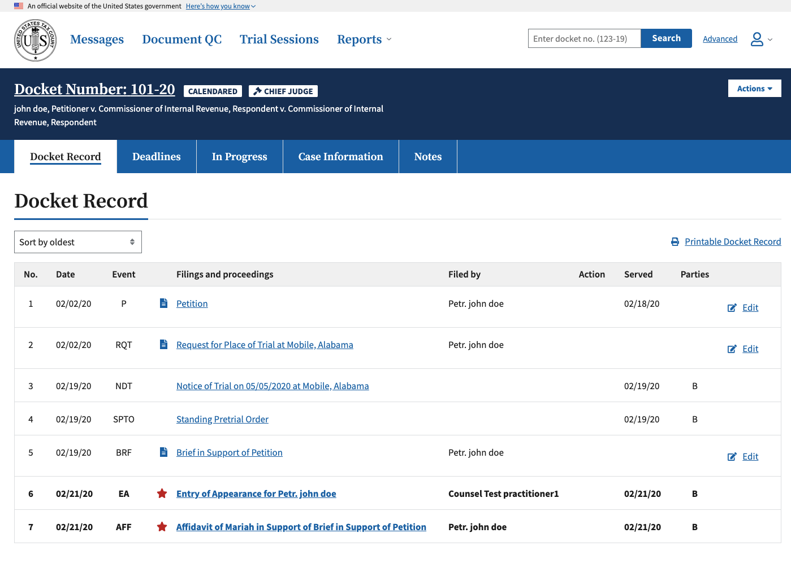
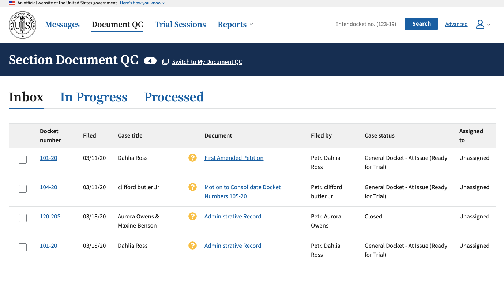
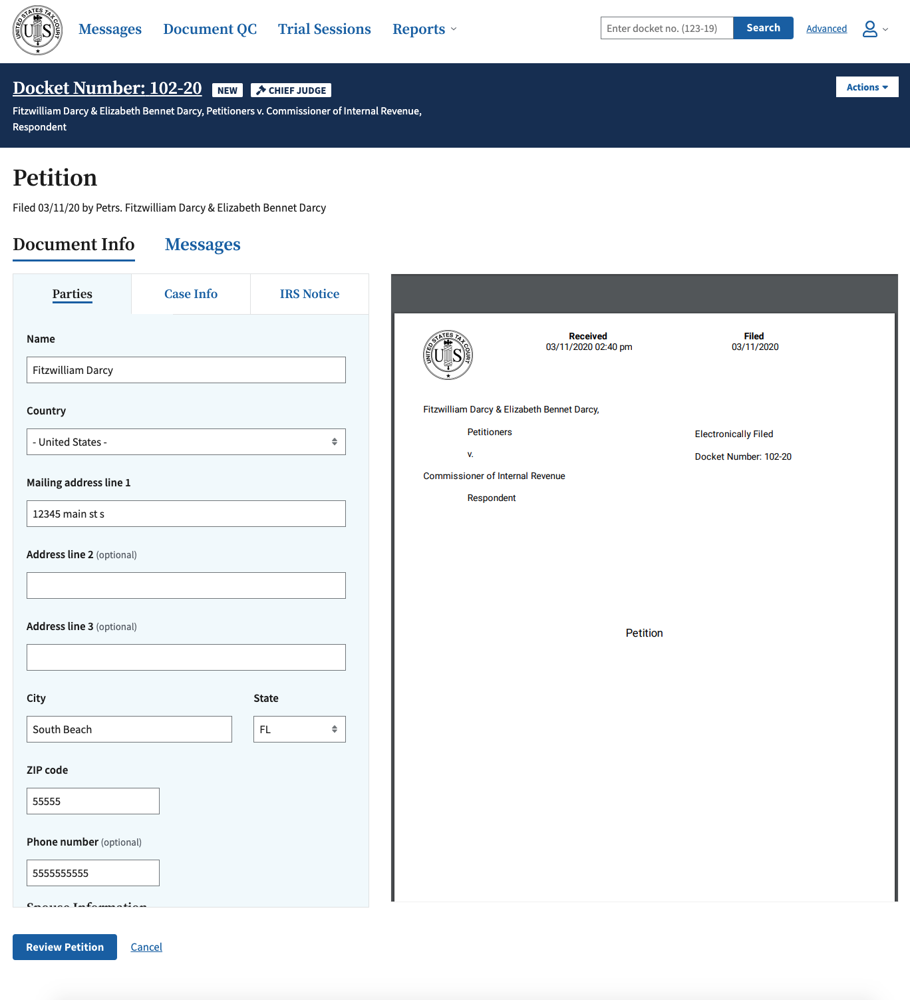
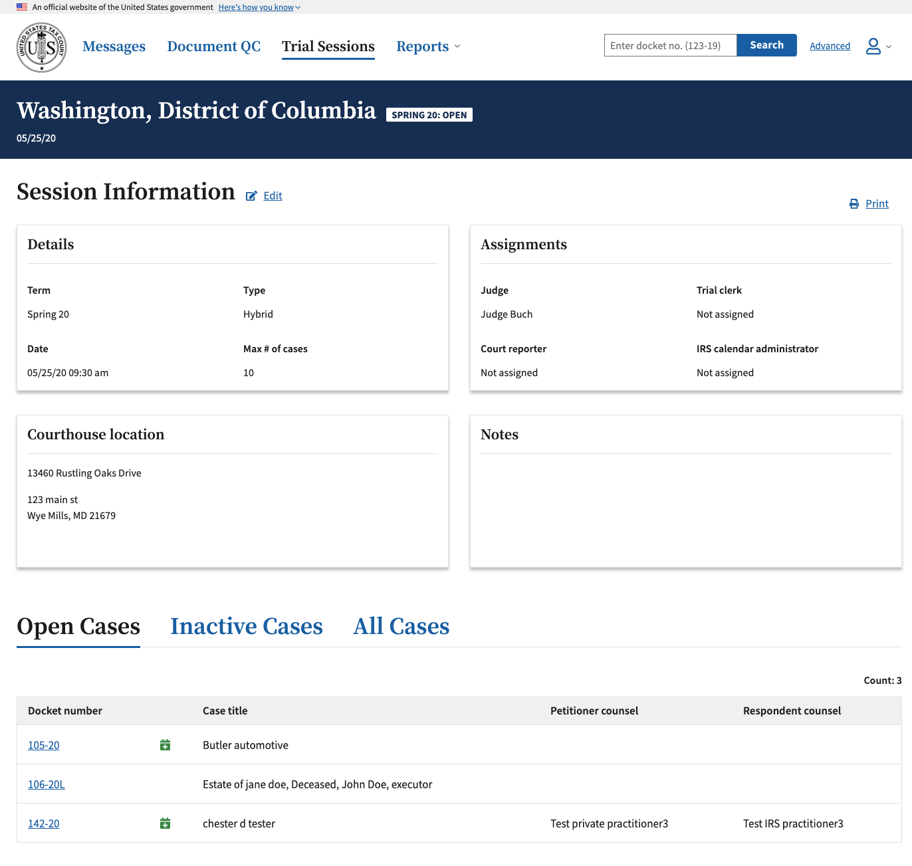

# Electronic Filing / Case Management System (DAWSON)

## Overview

**The [United States Tax Court](https://ustaxcourt.gov/)** is an independent Federal court that provides a forum for settling disputes between taxpayers and the Internal Revenue Service. There are approximately 200 employees at the Court and they handle approximately 60,000 petitions each year. About 60% of these petitions are filed from people without lawyers.

**DAWSON (Docket Access Within a Secure Online Network)** is the U.S. Tax Court's open source electronic filing and case management system, available in this repository. It was [named after a beloved Judge](https://www.ustaxcourt.gov/dawson.html) that kept meticulous records.

**Flexion** is the competitively awarded contractor that has been working on DAWSON since 2018. **18F** is a federal digital service team serving as advisors to the U.S. Tx Court and have paired with the U.S. Tax Court since the inception of DAWSON.

### User types

- **Petitioners** - Citizens filing a petition with the court; if filing without legal representation, referred to as pro-se petitioner
- **Practitioners** - Attorneys who file a petition on behalf of a petitioner
- **Internal court users** - System users responsible for managing cases within the system, work at Tax Court
- **IRS attorneys** - Work for IRS and file answers to petitions
- **General public** - Can search for a case on public website and see certain details about it that are open to the public

### Project status

DAWSON is in active use and is continually updated to deploy enhancements and new features.

- [Release notes](https://www.ustaxcourt.gov/release_notes.html) for DAWSON
- [How we work](./docs/how-we-work.md) has our principles, product team, technical strategy, meetings cadence, tools, etc.
- [Onboard](https://github.com/ustaxcourt/ef-cms/issues/new?template=onboarding.md) or [offboard](https://github.com/ustaxcourt/ef-cms/issues/new?template=offboarding.md) a teammate
- [Documentation](./docs/README.md) about the CI/CD setup, API, style guide, UX, code review, etc.
- [Ongoing development documentation](./wikiwiki/README.md) such as designs, research data, user workflows, etc.
- [Product roadmap](https://docs.google.com/document/d/1g3D1zPNQqVsWhJ6uGIVcHA04IdBHgYcOCm9roaSfFNk/edit) 🔒
- [Goals of DAWSON](https://docs.google.com/document/d/1xCh1hbXjJItOWlQ2MH-GDDc0KWho88KKcHfUJcpHkSs/edit) 🔒

### Backlog

| Backlog | Location
|---------|----------
| User stories and feature work <br>(Primary backlog) | [GitHub issues in Flexion’s repository](https://github.com/flexion/ef-cms/issues#workspaces/flexionef-cms-5bbe4bed4b5806bc2bec65d3/board?repos=152320868); scrum board visible using the [ZenHub browser plugin](https://www.zenhub.com/extension).
| Refactoring and bugs | [Trello cards in Flexion’s OpEx/DevEx board](https://trello.com/b/9tgrIFfA/ef-cms-opex-devex). 🔒
| Court-related decisions, processes, and environment work | [GitHub issues in this repository](https://github.com/ustaxcourt/ef-cms/issues); scrum board visible using the [ZenHub browser plugin](https://www.zenhub.com/).
| Court’s Authority to Operate process | [GitHub issues in this repository](https://github.com/ustaxcourt/ato/projects). 🔒

### Screenshots

<table>
	<tr>
		<td>
			<a href="docs/images/screenshot_docket.png"></a>
			<p>Case detail page / Docket record</p>
		</td>
		<td>
			<a href="docs/images/screenshot_qc.png"></a>
			<p>Quality control for documents</p>
		</td>
	</tr>
</table>

<table>
	<tr>
		<td>
			<a href="docs/images/screenshot_petition.png"></a>
			<p>Validating a petition</p>
		</td>
		<td>
			<a href="docs/images/screenshot_trialsession.png"></a>
			<p>Trial session details</p>
		</td>
	</tr>
</table>

### Milestones

- Dec 27, 2020 - DAWSON MVP launched and first petition received
- Nov 25, 2020 - Legacy data migration of 957,000 cases (5.5M PDFs) complete
- Nov 21, 2020 - Legacy system goes dark for legacy data transfer and court-wide quality control of records
- Nov 2, 2018 - [First code](https://github.com/ustaxcourt/ef-cms/pull/5) delivered and accepted by the Court
- Oct 11, 2018 - [First commit](https://github.com/ustaxcourt/ef-cms/commit/8d797f3554399bb94bafb39e32616d48eabb6790) of code
- Sep 27, 2018 - Contract awarded to Flexion
- Aug 2, 2018 - [Final solicitation](https://github.com/ustaxcourt/case-management-rfq) posted
- May 14 - 16, 2018 - Procurement workshop with 18F

## Technical overview

[](https://deepscan.io/dashboard#view=project&tid=8976&pid=17137&bid=383813)

| develop | prod | staging | test |
| ------- | ------ | ------- | ---- |
| [](https://circleci.com/gh/flexion/ef-cms/tree/develop) | [](https://circleci.com/gh/ustaxcourt/ef-cms/tree/prod) | [](https://circleci.com/gh/ustaxcourt/ef-cms/tree/staging) | [](https://circleci.com/gh/ustaxcourt/ef-cms/tree/test) |

API | Front-End | Shared Code
--- | --------- | -----------
[](https://sonarcloud.io/dashboard?id=ef-cms-api)<br>[](https://sonarcloud.io/dashboard?id=ef-cms-api)<br>[](https://sonarcloud.io/dashboard?id=ef-cms-api)<br> | [](https://sonarcloud.io/dashboard?id=ef-cms-front-end)<br>[](https://sonarcloud.io/dashboard?id=ef-cms-front-end)<br>[](https://sonarcloud.io/dashboard?id=ef-cms-front-end)| [](https://sonarcloud.io/dashboard?id=ef-cms-shared)<br>[](https://sonarcloud.io/dashboard?id=ef-cms-shared)<br>[](https://sonarcloud.io/dashboard?id=ef-cms-shared)

[](https://snyk.io//test/github/flexion/ef-cms?targetFile=package.json)

The fork of this project in which the bulk of development is occurring is [Flexion’s fork](https://github.com/flexion/ef-cms), but all changes are pulled into the U.S. Tax Court’s repository every two weeks.

This is a React-based JavaScript application. It’s housed in a [monorepo](https://en.wikipedia.org/wiki/Monorepo) that contains the front end (`web-client/`) and the back end (`web-api/`), with a third project housing resources that are shared between the front and back ends (`shared/`). It’s architected for Amazon Web Services, with a strong reliance on [Lambda](https://aws.amazon.com/lambda/), scripted with Terraform. The project is heavily containerized, using Docker, and can be run locally, despite the serverless architecture. Deployment is done via CircleCI.

### Local development

#### Testing everything

To exercise the CI/CD pipeline locally, run the following:

```sh
./docker-test-all.sh
```

This will run the linter, Shellcheck, audit, build, test, Cypress, Cerebral tests, Pa11y, etc. over all the components.

#### Running / verifying the project via Docker

Once [you have Docker installed](https://docs.docker.com/install/), the following command will spin up a Docker container with the UI, API, local S3, local Dynamo, etc. all running inside it:

```sh
./docker-run.sh
```

- You can access the UI at http://localhost:1234
- You can access the public UI at http://localhost:5678
- You can access the API at http://localhost:4000
- You can access the DynamoDB shell at http://localhost:8000/shell
- You can access the DynamoDB admin UI at http://localhost:8001
- You can access S3 local at http://localhost:9000
- You can access the style guide at http://localhost:1234/style-guide

Within Docker, you should allocate 2+ CPUs, 8+ GB of RAM, and 4+ GB of swap. With fewer resources, the software is likely to fail to run with errors that don’t make it obvious what the problem is.

#### ECR

ECR is Amazon’s Docker container registry that holds images for `ef-cms` builds on CircleCI. Currently, images can be managed in the AWS ECR console under the `ef-cms-us-east-1`. If you need to update the Docker image, you can do so (with appropriate permissions) by running `./docker-to-ecr.sh`. This command will build an image per the `Dockerfile-CI` config, tag it as `latest` and push it to the repo in ECR.

#### Running this project locally without Docker

The EF-CMS is comprised of two components: the API and the UI. Both must be run in order to function.

##### Prerequisites

- Node v14.16.0
- npm v6.14.11
- ClamAV v0.101.2 (see Setup below)
- Java 11
- jq

##### Setup

- Install the JDK from https://www.oracle.com/java/technologies/javase-jdk13-downloads.html
For ClamAV, macOS users can do the following:
- `brew install clamav`
- `cp /usr/local/etc/clamav/freshclam.conf.sample /usr/local/etc/clamav/freshclam.conf`
- `sed -ie 's/^Example/#Example/g' /usr/local/etc/clamav/freshclam.conf` (comments out `Example` in the `freshclam.conf` file)
- Installing `jq`
  - `brew install jq` for macOS users or visit https://stedolan.github.io/jq/download/

Both the front-end (`/web-client`) and API (`/web-api`) share code that exists in `/shared`. Before you can run either, you need to run `npm install` inside the top-level directory.

- `npm i`

###### Terminal A

- `npm run start:api`

Other start commands:

- Run `cd web-client && npm run start:client:no-scanner` to start the UI without Dynamsoft (or if you don't have a scanner)
- Run `npm run start:public` to start the UI for the public access portion of the site

###### Terminal B

- `npm run start:client`

#### Login and test users

There are two login mechanisms available — the legacy mock login system, and a new one that emulates AWS Cognito.

##### Mock login

You can log in using the following accounts.

###### External Users

```txt
petitioner@example.com
privatePractitioner@example.com
privatePractitioner1 - privatePractitioner4@example.com
irsPractitioner@example.com
irsPractitioner1 - irsPractitioner4@example.com
irsSuperuser@example.com
```

###### Internal Users

```txt
adc@example.com
admissionsclerk@example.com
clerkofcourt@example.com
docketclerk@example.com
docketclerk1@example.com
floater@example.com
general@example.com
petitionsclerk@example.com
petitionsclerk1@example.com
reportersOffice@example.com
trialclerk@example.com
judge.ashford@example.com
ashfordsChambers@example.com
judge.buch@example.com
buchsChambers@example.com
stjudge.carluzzo@example.com
carluzzosChambers@example.com
judge.cohen@example.com
cohensChambers@example.com
judge.colvin@example.com
colvinsChambers@example.com
```

No password is required.

##### AWS Cognito

To use Cognito, start the web client with `npm run dev:cognito` (instead of `npm start`) You can then log in with the following accounts.

###### External Users

```txt
petitioner1@example.com – petitioner5@example.com
privatePractitioner1@example.com – privatePractitioner10@example.com
irsPractitioner1@example.com – irsPractitioner10@example.com
service.agent.test@irs.gov (IRS Superuser)
```

###### Internal Users

```txt
adc1@example.com – adc5@example.com
admissionsclerk1@example.com – admissionsclerk5@example.com
clerkofcourt1@example.com – clerkofcourt5@example.com
docketclerk1@example.com – docketclerk5@example.com
floater1@example.com – floater2@example.com
general1@example.com – general2@example.com
petitionsclerk1@example.com – petitionsclerk5@example.com
reportersOffice1@example.com – reportersOffice2@example.com
trialclerk1@example.com – trialclerk5@example.com
jashford@example.com
ashfordsChambers1@example.com - ashfordsChambers5@example.com
jbuch@example.com
buchsChambers1@example.com - buchsChambers5@example.com
jcohen@example.com
cohensChambers1@example.com – cohensChambers5@example.com
```

For a full list of available users, see [court_users.csv](web-api/court_users.csv).

The password for all accounts is set as an environment variable: `DEFAULT_ACCOUNT_PASS`.

#### Editor configuration

##### Atom.io

Install the following for best results:

- https://atom.io/packages/language-javascript-jsx
- https://atom.io/packages/language-groovy
- https://atom.io/packages/linter-eslint
- https://atom.io/packages/prettier-atom (enable ESLint and StyleLint integrations in settings)

#### Testing / Coverage Tips

- Run all tests with `npm run test`
- The web client, API, and shared code can be tested with `npm run test:client`, `npm run test:api`, and `npm run test:shared`, respectively
- Tip: When working through a single test, you can run a single test with `jest /path/to/test/file.js` (you may need to `npm -i -g jest`). Additionally, you can use `--watch` and `--coverage` flags to to continually run the specified test on save and provide a coverage report. For example: `jest /path/to/test/file.js --watch --coverage`

Example coverage output:
```
----------|----------|----------|----------|----------|-------------------|
File      |  % Stmts | % Branch |  % Funcs |  % Lines | Uncovered Line #s |
----------|----------|----------|----------|----------|-------------------|
All files |        0 |        0 |        0 |        0 |                   |
----------|----------|----------|----------|----------|-------------------|
```
- Stmts: % of statements executed in the code
- Branch: % of control structures (for example, `if` statements) executed in the code
- Funcs: % of functions executed in the code
- Uncovered Line #s: lines not covered by tests

#### Accessibility HTML_CodeSniffer Bookmarklet

The following bookmarklet is useful for running pa11y directly on the page you are viewing.  The following link should have instruction on how to setup and use:

https://squizlabs.github.io/HTML_CodeSniffer/

#### Querying Elasticsearch locally

To query elasticsearch locally, run this docker container

```sh
docker run -p 3030:3030 -d appbaseio/mirage
```

- Open your browser to http://localhost:3030

- Update your `.elasticsearch/config/elasticsearch.yml` to have the following pasted at the bottom:

  ```yml
  http.port: 9200
  http.cors.allow-origin: "/.*/"
  http.cors.enabled: true
  http.cors.allow-headers: X-Requested-With,X-Auth-Token,Content-Type, Content-Length, Authorization
  http.cors.allow-credentials: true
  ```

## Load testing

See [ustaxcourt/ef-cms-load-tests](https://github.com/ustaxcourt/ef-cms-load-tests) for Maven load tests.

## Contributing

See [CONTRIBUTING](CONTRIBUTING.md) for additional information.


## Public domain

This project is in the worldwide [public domain](LICENSE.md). As stated in [CONTRIBUTING](CONTRIBUTING.md):

> This project is in the public domain within the United States, and copyright and related rights in the work worldwide are waived through the [CC0 1.0 Universal public domain dedication](https://creativecommons.org/publicdomain/zero/1.0/).
>
> All contributions to this project will be released under the CC0 dedication. By submitting a pull request, you are agreeing to comply with this waiver of copyright interest.
