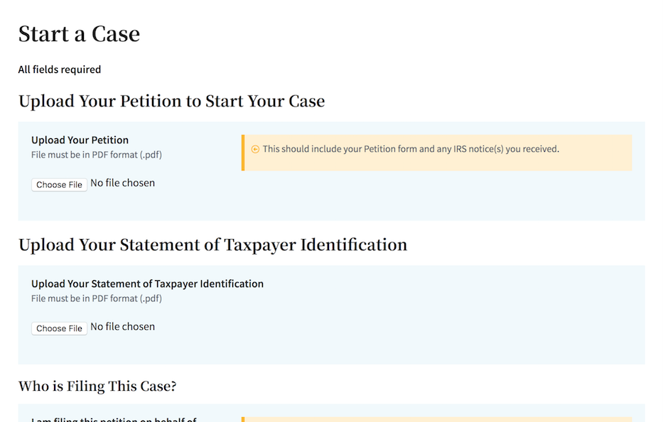
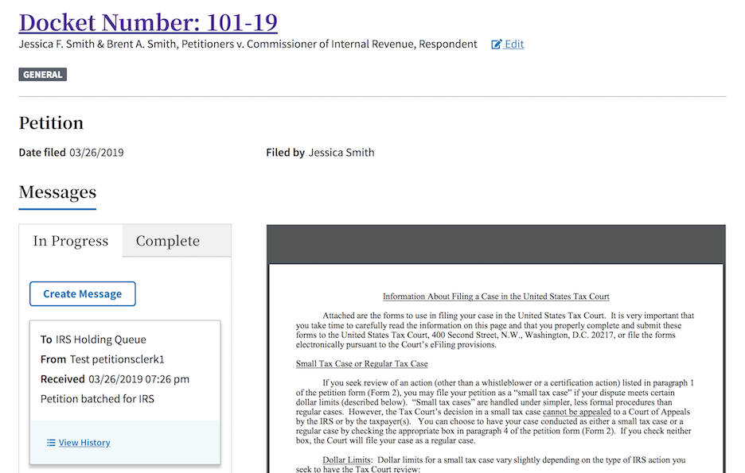
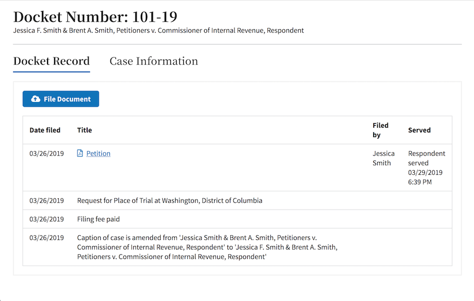

# Electronic Filing / Case Management System

An as-yet-unnamed project by the [U.S. Tax Court](https://ustaxcourt.gov/), creating an open-source EF-CMS. Work began in October 2018, and can be seen [in the staging branch](https://github.com/ustaxcourt/ef-cms/tree/staging). For background, see [the RFQ to procure agile software development services](https://github.com/ustaxcourt/case-management-rfq).

## Technical overview

This is a React-based Javascript application. It’s housed in a [monorepo](https://en.wikipedia.org/wiki/Monorepo) that contains the front end (`web-client/`) and the back end (`efcms-service/`), with a third project housing resources that are shared between the front and back ends (`shared/`). It’s architected for Amazon Web Services, with a strong reliance on [Lambda](https://aws.amazon.com/lambda/), scripted with Terraform. The project is heavily containerized, using Docker, and can be run locally, despite the serverless architecture. All CI/CD processes are found in `management/`. Deployment is done via a Jenkins server, and [that process is documented in `SETUP.md`](SETUP.md).

## Documentation
* There is a style guide available at http://localhost:1234/style-guide.
* The Javascript is marked up with [JSDoc](https://github.com/jsdoc3/jsdoc) comments, so documentation can be built by running `jsdoc -r .` locally.
* The API is documented via Swagger, and can be reviewed at http://localhost:3000/v1/swagger.
* The deployment process is documented in [`SETUP.md`](SETUP.md).
* The end-of-sprint code review process is documented in [`CODE_REVIEW.md`](CODE_REVIEW.md).

## Building everything

To run the same checks that run in Jenkins (except SonarQube) locally, using Docker containers, run the following:

`./build-all.sh`

This will run the lint, Shellcheck, audit, build, test, Cypress, Cerebral tests, Pa11y, etc. over all the components.

## Running / verifing the project via Docker

Assuming you have Docker installed, the following command will spin up a Docker container with the UI, API, local S3, local Dynamo, etc. all running inside it:

`./docker-run.sh`

You can access the UI at  http://localhost:1234
You can access the API at http://localhost:3000
You can access the dynamodb shell at http://localhost:8000/shell
You can access the dynamodb-admin ui at http://localhost:8001
You can access s3 local at http://localhost:9000
You can access the style guide at http://localhost:1234/style-guide

## Running this project locally without Docker

The EF-CMS is comprised of two components: the API and the UI. Both must be run in order to function.

### Prerequisites
- Node v8.10.0
- npm 6.4.1

### Setup

Both the web-client and efcms-service share code that exists in the `shared` directory; therefore, before you can run either, you need to run `npm install` inside the `shared` directory.

- `cd shared && npm i`
- `cd ../web-client && npm i`
- `cd ../efcms-service && npm i`

#### Terminal A
- `cd web-client && npm start`

#### Terminal B
- `cd efcms-service && npm start`

### CI/CD Setup

For instructions on how to build the DevOps pipeline and deploy the software to AWS, see [SETUP.md](SETUP.md).

### Editor configuration

#### Atom.io

Install the following for best results:

- https://atom.io/packages/language-javascript-jsx
- https://atom.io/packages/language-groovy
- https://atom.io/packages/linter-eslint
- https://atom.io/packages/prettier-atom (enable ESLint and StyleLint integrations in settings)

## Using the application with Internet Explorer 11

If using Internet Explorer 11 with Windows 7, download the Adobe Reader application at https://get.adobe.com/reader/. Install as directed. This will permit PDFs to be viewed in-browser with Internet Explorer 11.

## Forked dependencies
The software has several dependencies that required minor modifications to suit our needs. Rather than attempt to persuade their creators to adopt our modifications, those repositories have been forked within the U.S. Tax Court's GitHub organization, and the modifications made there. Those repsitories are:

* [serverless-s3-local](https://github.com/ustaxcourt/serverless-s3-local)
* [s3rver](https://github.com/ustaxcourt/s3rver)
* [serverless-plugin-bind-deployment-id](https://github.com/ustaxcourt/serverless-plugin-bind-deployment-id)

_If these repositories are deleted, the build will fail._ To verify that these repositories are still required, see each of the `package.json` files in the repo (e.g., `find . -name package.json -exec grep "github:ustaxcourt" {} \; |awk 'BEGIN {FS=": ";}{print$2}' |uniq`). Note that `s3rver` is a dependency of `serverless-s3-local`, and so it will not be found in our `package.json` files.

## Contributing

See [CONTRIBUTING](CONTRIBUTING.md) for additional information.

## Public domain

This project is in the worldwide [public domain](LICENSE.md). As stated in [CONTRIBUTING](CONTRIBUTING.md):

> This project is in the public domain within the United States, and copyright and related rights in the work worldwide are waived through the [CC0 1.0 Universal public domain dedication](https://creativecommons.org/publicdomain/zero/1.0/).
>
> All contributions to this project will be released under the CC0 dedication. By submitting a pull request, you are agreeing to comply with this waiver of copyright interest.

