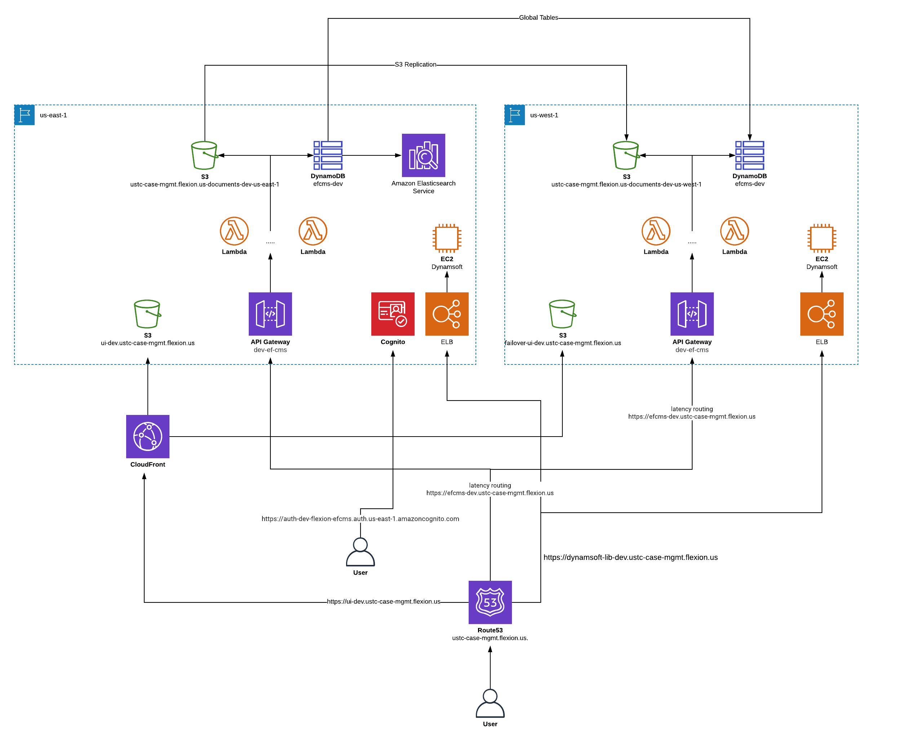

# Electronic Filing / Case Management System

The [U.S. Tax Court](https://ustaxcourt.gov/) currently uses a non-web-based legacy case management system operated through several, disparate desktop applications installed on individual workstations. Flexion was awarded a competitive bid in October 2018 to develop and deploy a new web-based electronic filing and case management system that would provide a single integrated point to handle all communication, documentation, and task workflows associated with moving a case through the Court from inception to completion. The new system would allow the public to file new cases, track them, and submit additional information about their cases through a secure online portal, instead of the current mail-based, paper petitioning process. It also provides the Court with the means to transfer most of their paper-based processes and workflows into easier, more efficient online ones.

### Build Status

#### develop

| develop | master | staging | test |
| ------- | ------ | ------- | ---- |
| [](https://circleci.com/gh/flexion/ef-cms/tree/develop) | [](https://circleci.com/gh/ustaxcourt/ef-cms/tree/master) | [](https://circleci.com/gh/ustaxcourt/ef-cms/tree/staging) | [](https://circleci.com/gh/ustaxcourt/ef-cms/tree/test) |

API | Front-End | Shared Code
--- | --------- | -----------
[](https://sonarcloud.io/dashboard?id=ef-cms-api)<br>[](https://sonarcloud.io/dashboard?id=ef-cms-api)<br>[](https://sonarcloud.io/dashboard?id=ef-cms-api)<br> | [](https://sonarcloud.io/dashboard?id=ef-cms-front-end)<br>[](https://sonarcloud.io/dashboard?id=ef-cms-front-end)<br>[](https://sonarcloud.io/dashboard?id=ef-cms-front-end)| [](https://sonarcloud.io/dashboard?id=ef-cms-shared)<br>[](https://sonarcloud.io/dashboard?id=ef-cms-shared)<br>[](https://sonarcloud.io/dashboard?id=ef-cms-shared)

[](https://snyk.io//test/github/flexion/ef-cms?targetFile=package.json)

## Screenshots of new system

### Case detail page / Docket record
<a href="docs/images/screenshot_docket.png"></a>

### Quality control for documents
<a href="docs/images/screenshot_qc.png"></a>

### Validating a Petition

<a href="docs/images/screenshot_petition.png"></a>

### Trial session details

<a href="docs/images/screenshot_trialsession.png"></a>

<br clear="both">

The fork of this project in which the bulk of development is occurring is [Flexion’s fork](https://github.com/flexion/ef-cms), but all changes are pulled into the U.S. Tax Court’s repository every two weeks.

Artifacts for ongoing development such as designs, research data, user workflows etc. are located in the [wiki](https://github.com/flexion/ef-cms/wiki). See also [documentation about how we work](https://github.com/ustaxcourt/ef-cms/blob/staging/docs/how-we-work.md): our principles, product team, technical strategy, meetings cadence, tools, etc.

## Technical overview

This is a React-based JavaScript application. It’s housed in a [monorepo](https://en.wikipedia.org/wiki/Monorepo) that contains the front end (`web-client/`) and the back end (`web-api/`), with a third project housing resources that are shared between the front and back ends (`shared/`). It’s architected for Amazon Web Services, with a strong reliance on [Lambda](https://aws.amazon.com/lambda/), scripted with Terraform. The project is heavily containerized, using Docker, and can be run locally, despite the serverless architecture. All CI/CD processes are found in `management/`. Deployment is done via CircleCI.

## Documentation

For documentation about the CI/CD setup, API, style guide, UX, code review, etc., see [docs/README.md](docs/README.md).

## AWS diagram

<a href="docs/images/aws-diagram.png"></a>

## Backlog

There are a few backlogs related to the project:

| Items | Location
|-------|----------
| User stories and feature work <br>(Primary backlog) | [GitHub issues in Flexion’s repository](https://github.com/flexion/ef-cms/issues); scrum board visible using the [ZenHub browser plugin](https://www.zenhub.com/).
| Refactoring and bugs | [Trello cards in Flexion’s OpEx/DevEx board](https://trello.com/b/9tgrIFfA/ef-cms-opex-devex).
| Court-related decisions, processes, and environment work | [GitHub issues in this repository](https://github.com/ustaxcourt/ef-cms/issues); scrum board visible using the [ZenHub browser plugin](https://www.zenhub.com/).
| Data migration script work | [GitHub issues in this private repository](https://github.com/ustaxcourt/ef-cms-migration/issues); scrum board using [GitHub projects](https://github.com/ustaxcourt/ef-cms-migration/projects).

## Testing everything

To exercise the CI/CD pipeline locally, run the following:

`./docker-test-all.sh`

This will run the linter, Shellcheck, audit, build, test, Cypress, Cerebral tests, Pa11y, etc. over all the components.

## Running / verifying the project via Docker

Once [you have Docker installed](https://docs.docker.com/install/), the following command will spin up a Docker container with the UI, API, local S3, local Dynamo, etc. all running inside it:

`./docker-run.sh`

- You can access the UI at http://localhost:1234
- You can access the public UI at http://localhost:5678
- You can access the API at http://localhost:4000
- You can access the DynamoDB shell at http://localhost:8000/shell
- You can access the DynamoDB admin UI at http://localhost:8001
- You can access S3 local at http://localhost:9000
- You can access the style guide at http://localhost:1234/style-guide

Within Docker, you should allocate 2+ CPUs, 8+ GB of RAM, and 4+ GB of swap. With fewer resources, the software is likely to fail to run with errors that don’t make it obvious what the problem is.

### ECR
ECR is Amazon’s Docker container registry that holds images for `ef-cms` builds on CircleCI. Currently, images can be managed in the AWS ECR console under the `ef-cms-us-east-1`. If you need to update the Docker image, you can do so (with appropriate permissions) by running `./docker-to-ecr.sh`. This command will build an image per the `Dockerfile-CI` config, tag it as `latest` and push it to the repo in ECR.

## Running this project locally without Docker

The EF-CMS is comprised of two components: the API and the UI. Both must be run in order to function.

### Prerequisites

- Node v12.13.1
- npm v6.12.1
- ClamAV v0.101.2 (see Setup below)
-  Java 11

### Setup

- Install the JDK from https://www.oracle.com/java/technologies/javase-jdk13-downloads.html
For ClamAV, macOS users can do the following:
- `brew install clamav`
- `cp /usr/local/etc/clamav/freshclam.conf.sample /usr/local/etc/clamav/freshclam.conf`
- `sed -ie 's/^Example/#Example/g' /usr/local/etc/clamav/freshclam.conf` (comments out `Example` in the `freshclam.conf` file)

Both the front-end (`/web-client`) and API (`/web-api`) share code that exists in `/shared`. Before you can run either, you need to run `npm install` inside the top-level directory.

- `npm i`

#### Terminal A

- `npm run start:api`

##### Other Start Commands

- Run `cd web-client && npm run start:client:no-scanner` to start the UI without Dynamsoft (or if you don't have a scanner)
- Run `npm run start:public` to start the UI for the public access portion of the site

#### Terminal B

- `npm run start:client`

## Login and test users

There are two login mechanisms available — the legacy mock login system, and a new one that emulates AWS Cognito.

### Mock login

You can log in using the following accounts.

#### External Users

```
petitioner
privatePractitioner
privatePractitioner1 - privatePractitioner4
irsPractitioner
irsPractitioner1 - irsPractitioner4
irsSuperuser
```

#### Internal Users
```
adc
admissionsclerk
clerkofcourt
docketclerk
docketclerk1
petitionsclerk
petitionsclerk1
trialclerk
judgeArmen
armensChambers
judgeAshford
ashfordsChambers
judgeBuch
buchsChambers
judgeCarluzzo
carluzzosChambers
judgeCohen
cohensChambers
```

No password is required.

### AWS Cognito

To use Cognito, start the web client with `npm run dev:cognito` (instead of `npm start`) You can then log in with the following accounts.

#### External Users
```
petitioner1@example.com – petitioner5@example.com
privatePractitioner1@example.com – privatePractitioner10@example.com
irsPractitioner1@example.com – irsPractitioner10@example.com
service.agent.test@irs.gov (IRS Superuser)
```

#### Internal Users
```
adc1@example.com – adc5@example.com
admissionsclerk1@example.com – admissionsclerk5@example.com
clerkofcourt1@example.com – clerkofcourt5@example.com
docketclerk1@example.com – docketclerk5@example.com
petitionsclerk1@example.com – petitionsclerk5@example.com
trialclerk1@example.com – trialclerk5@example.com
jashford@example.com
ashfordsChambers1@example.com - ashfordsChambers5@example.com
jbuch@example.com
buchsChambers1@example.com - buchsChambers5@example.com
jcohen@example.com
cohensChambers1@example.com – cohensChambers5@example.com
```

For a full list of available users, see [court_users.csv](web-api/court_users.csv).

The password for all accounts is:

`Testing1234$`

## Editor configuration

### Atom.io

Install the following for best results:

- https://atom.io/packages/language-javascript-jsx
- https://atom.io/packages/language-groovy
- https://atom.io/packages/linter-eslint
- https://atom.io/packages/prettier-atom (enable ESLint and StyleLint integrations in settings)

## Contributing

See [CONTRIBUTING](CONTRIBUTING.md) for additional information.

## Testing / Coverage Tips

- Run all tests with `npm run test`
- The web client, API, and shared code can be tested with `npm run test:client`, `npm run test:api`, and `npm run test:shared`, respectively
- Tip: When working through a single test, you can run a single test with `jest /path/to/test/file.js` (you may need to `npm -i -g jest`). Additionally, you can use `--watch` and `--coverage` flags to to continually run the specified test on save and provide a coverage report. For example: `jest /path/to/test/file.js --watch --coverage`

Example coverage output:
```
----------|----------|----------|----------|----------|-------------------|
File      |  % Stmts | % Branch |  % Funcs |  % Lines | Uncovered Line #s |
----------|----------|----------|----------|----------|-------------------|
All files |        0 |        0 |        0 |        0 |                   |
----------|----------|----------|----------|----------|-------------------|
```
- Stmts: % of statements executed in the code
- Branch: % of control structures (for example, `if` statements) executed in the code
- Funcs: % of functions executed in the code
- Uncovered Line #s: lines not covered by tests

## Public domain

This project is in the worldwide [public domain](LICENSE.md). As stated in [CONTRIBUTING](CONTRIBUTING.md):

> This project is in the public domain within the United States, and copyright and related rights in the work worldwide are waived through the [CC0 1.0 Universal public domain dedication](https://creativecommons.org/publicdomain/zero/1.0/).
>
> All contributions to this project will be released under the CC0 dedication. By submitting a pull request, you are agreeing to comply with this waiver of copyright interest.

## Creating end-of-sprint pull requests

Follow these steps for creating the end of sprint PRs for the court.

1. Create a PR from `develop` -> `staging`
2. Verify PR passed
3. Merge PR and verify staging deployed correctly in CircleCI
4. Create a PR from `staging` -> `master`
5. Verify PR passed
6. Merge PR and verify prod deployed correctly in CircleCI
7. Create a PR from `flexion/ef-cms master` -> `ustaxcourt/ef-cms staging`
8. When PR comments come in, make changes to master to fix the comments
9. After the court approves and merges PR, merge master into develop
10. Create a release in GitHub as sprint_00x against master and put the same description planned to be in the PR description for the court

## Accessibility HTML_CodeSniffer Bookmarklet

The following bookmarklet is useful for running pa11y directly on the page you are viewing.  The following link should have instruction on how to setup and use:

https://squizlabs.github.io/HTML_CodeSniffer/
