# EF-CMS Database ER Diagram

This diagram represents the database schema for the EF-CMS (Electronic Filing - Case Management System) based on the `database-schema.ts` file.

## Entity Relationship Diagram

```mermaid
erDiagram
    %% Core Case Management
    dwCase {
        string case_id PK
        string case_title
        string case_status
        string case_type
        date filing_date
        string judge_id FK
        string court_id
    }
    
    dwDocketEntry {
        string docket_entry_id PK
        string case_id FK
        string document_type
        string filing_date
        string filed_by
        string document_title
        string status
    }
    
    dwUser {
        string user_id PK
        string email
        string name
        string role
        string bar_number
        string status
    }
    
    %% User-Case Relationships
    dwUserOnCase {
        string user_on_case_id PK
        string user_id FK
        string case_id FK
        string role
        string status
        date date_added
    }
    
    dwUserOnCasePending {
        string user_on_case_pending_id PK
        string user_id FK
        string case_id FK
        string role
        string status
        date date_requested
    }
    
    %% Case Supporting Entities
    dwCaseWorksheet {
        string case_worksheet_id PK
        string case_id FK
        string judge_id FK
        string status
        date date_created
        string notes
    }
    
    dwCaseDeadline {
        string case_deadline_id PK
        string case_id FK
        string deadline_type
        date deadline_date
        string description
        string status
    }
    
    dwCaseCorrespondence {
        string case_correspondence_id PK
        string case_id FK
        string correspondence_type
        date correspondence_date
        string subject
        string content
    }
    
    %% Docket Entry Supporting Entities
    dwDocketEntryWorksheet {
        string docket_entry_worksheet_id PK
        string docket_entry_id FK
        string judge_id FK
        string status
        date date_created
        string notes
    }
    
    dwMinuteSheet {
        string minute_sheet_id PK
        string case_id FK
        string docket_entry_id FK
        date hearing_date
        string hearing_type
        string notes
    }
    
    %% Work Management
    dwWorkItem {
        string work_item_id PK
        string case_id FK
        string docket_entry_id FK
        string work_item_type
        string status
        date due_date
        string assigned_to FK
    }
    
    %% User Management
    dwBarNumber {
        string bar_number_id PK
        string user_id FK
        string bar_number
        string state
        date admission_date
        string status
    }
    
    dwUserConfirmationCode {
        string confirmation_code_id PK
        string user_id FK
        string confirmation_code
        date expiration_date
        string status
    }
    
    dwUserCaseNote {
        string user_case_note_id PK
        string user_id FK
        string case_id FK
        string note_content
        date note_date
        string note_type
    }
    
    %% Communication & Notifications
    dwMessage {
        string message_id PK
        string from_user_id FK
        string to_user_id FK
        string subject
        string message_content
        date message_date
        string status
    }
    
    dwNotification {
        string notification_id PK
        string user_id FK
        string notification_type
        string notification_content
        date notification_date
        string status
    }
    
    dwConnection {
        string connection_id PK
        string user_id FK
        string connection_type
        date connection_date
        string status
    }
    
    %% System & Polling
    dwResponseString {
        string response_string_id PK
        string response_type
        string response_content
        date response_date
        string status
    }
    
    dwChangeOfAddress {
        string change_of_address_id PK
        string user_id FK
        string old_address
        string new_address
        date change_date
        string status
    }
    
    %% Relationships
    dwCase ||--o{ dwDocketEntry : "has"
    dwCase ||--o{ dwUserOnCase : "involves"
    dwCase ||--o{ dwUserOnCasePending : "pending_involvement"
    dwCase ||--o{ dwCaseWorksheet : "has_worksheet"
    dwCase ||--o{ dwCaseDeadline : "has_deadlines"
    dwCase ||--o{ dwCaseCorrespondence : "has_correspondence"
    dwCase ||--o{ dwMinuteSheet : "has_minutes"
    dwCase ||--o{ dwWorkItem : "has_work_items"
    
    dwDocketEntry ||--o{ dwDocketEntryWorksheet : "has_worksheet"
    dwDocketEntry ||--o{ dwMinuteSheet : "referenced_in"
    dwDocketEntry ||--o{ dwWorkItem : "generates_work"
    
    dwUser ||--o{ dwUserOnCase : "participates_in"
    dwUser ||--o{ dwUserOnCasePending : "pending_participation"
    dwUser ||--o{ dwBarNumber : "has"
    dwUser ||--o{ dwUserConfirmationCode : "has"
    dwUser ||--o{ dwUserCaseNote : "creates"
    dwUser ||--o{ dwMessage : "sends"
    dwUser ||--o{ dwMessage : "receives"
    dwUser ||--o{ dwNotification : "receives"
    dwUser ||--o{ dwConnection : "has"
    dwUser ||--o{ dwChangeOfAddress : "requests"
    dwUser ||--o{ dwWorkItem : "assigned_to"
    
    dwUserOnCase }o--|| dwUser : "belongs_to"
    dwUserOnCase }o--|| dwCase : "belongs_to"
    dwUserOnCasePending }o--|| dwUser : "belongs_to"
    dwUserOnCasePending }o--|| dwCase : "belongs_to"
    
    dwCaseWorksheet }o--|| dwCase : "belongs_to"
    dwCaseDeadline }o--|| dwCase : "belongs_to"
    dwCaseCorrespondence }o--|| dwCase : "belongs_to"
    dwMinuteSheet }o--|| dwCase : "belongs_to"
    dwWorkItem }o--|| dwCase : "belongs_to"
    
    dwDocketEntryWorksheet }o--|| dwDocketEntry : "belongs_to"
    dwDocketEntryWorksheet }o--|| dwUser : "assigned_to"
    
    dwBarNumber }o--|| dwUser : "belongs_to"
    dwUserConfirmationCode }o--|| dwUser : "belongs_to"
    dwUserCaseNote }o--|| dwUser : "belongs_to"
    dwUserCaseNote }o--|| dwCase : "belongs_to"
    
    dwMessage }o--|| dwUser : "from_user"
    dwMessage }o--|| dwUser : "to_user"
    dwNotification }o--|| dwUser : "belongs_to"
    dwConnection }o--|| dwUser : "belongs_to"
    dwChangeOfAddress }o--|| dwUser : "belongs_to"
```

## Table Descriptions

### Core Entities
- **dwCase**: Main case records with case information, status, and metadata
- **dwDocketEntry**: Individual documents and filings within cases
- **dwUser**: System users including judges, attorneys, and staff

### Relationship Tables
- **dwUserOnCase**: Links users to cases with specific roles
- **dwUserOnCasePending**: Pending user-case relationships awaiting approval

### Supporting Entities
- **dwCaseWorksheet**: Case-specific worksheets and notes for judges
- **dwCaseDeadline**: Important dates and deadlines for cases
- **dwCaseCorrespondence**: Case-related communications
- **dwDocketEntryWorksheet**: Document-specific worksheets
- **dwMinuteSheet**: Hearing minutes and court proceedings
- **dwWorkItem**: Tasks and work items generated from cases/documents

### User Management
- **dwBarNumber**: Attorney bar numbers and licensing information
- **dwUserConfirmationCode**: User verification and confirmation codes
- **dwUserCaseNote**: User-specific notes on cases

### Communication
- **dwMessage**: Internal messaging between users
- **dwNotification**: System notifications and alerts
- **dwConnection**: User connections and relationships

### System Tables
- **dwResponseString**: System response strings for polling
- **dwChangeOfAddress**: Address change requests and tracking

## Key Features

- **OpenSearch Integration**: Cases, docket entries, and users are indexed in OpenSearch for search functionality
- **Role-Based Access**: Users can have different roles on different cases
- **Workflow Management**: Work items track tasks and assignments
- **Audit Trail**: Comprehensive tracking of changes and activities
- **Multi-User Support**: Multiple users can be involved in cases with different permissions

## Notes

- All table names are prefixed with `dw` (Data Warehouse)
- The schema supports both PostgreSQL and OpenSearch for different use cases
- Relationships are primarily through foreign keys on user_id and case_id
- The system appears to be designed for court case management with comprehensive user and document tracking
