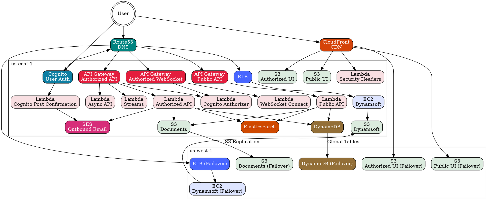
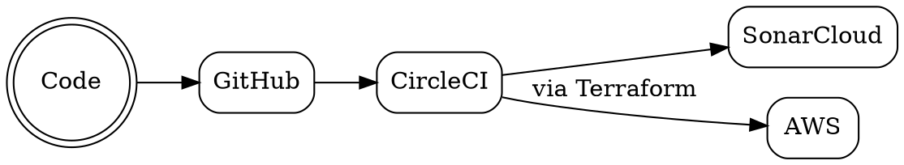

# EF-CMS Documentation

Table of contents:

- [Designing for users of EF-CMS](#designing-for-users-of-ef-cms)
- [System architecture](#system-architecture)
- [Developing EF-CMS on a local developer machine](#developing-ef-cms-on-a-local-developer-machine)
- [Reviewing and accepting changes to EF-CMS](#reviewing-and-accepting-changes-to-ef-cms)
- [Operating EF-CMS within AWS](#operating-ef-cms-within-aws)

## Designing for users of EF-CMS

| Item | Description
|------|-------------
| User personas | All user personas are documented in [user-personas.pdf](user-personas.pdf).
| UX research | Flexion maintains [a collection of UX documentation](https://github.com/flexion/ef-cms/wiki/UX-Documentation), including [initial onsite user research](https://drive.google.com/open?id=1iapbWu6FFk6jWUdZyO_E4MUrwBpk0S9VCfhs_04yWJ0), [system user flows](https://www.lucidchart.com/invitations/accept/3548e4bf-2677-43ba-9707-c8ee797381eb), [user roles and permissions](https://docs.google.com/spreadsheets/d/1Hh7xMlnW87ospse50CWlwnGBrifrINeCyR2a8E--9wg/edit?usp=sharing), and a [content document](https://docs.google.com/spreadsheets/d/1lDbnSUwi85e-nQ7o1sNLpj2vzRFiTSeav5u3B3z_SZ4/edit?usp=sharing).
| Glossary of terminology | This project involves a great deal of specialized legal and court terminology. A [glossary of terminology](https://github.com/flexion/ef-cms/wiki/Glossary) is found on Flexion's wiki.

## System architecture

| Item | Description
|------|-------------
| Architecture Decision Records | See [the decisions folder](./architecture/decisions/) for more insight into how the application’s architecture came to be.
| Testing | See [testing overview](./testing.md).
| Email | The [email documentation](./architecture/email.md) includes sending domains and information about SPF, DKIM, and DMARC records.

### AWS diagram

Source for diagram
 

This diagram was created with [Graphviz](https://graphviz.org/), and the source is below for future edits. Use an online editor, such as [Edotor](https://edotor.net/), and download the resulting graph PNG to update the image. Don’t forget to copy-paste the source back into this page for next time an edit is needed!

Source for diagram
 

This diagram was created with [Graphviz](https://graphviz.org/), and the source is below for future edits. Use an online editor, such as [Edotor](https://edotor.net/), and download the resulting graph PNG to update the image. Don’t forget to copy-paste the source back into this page for next time an edit is needed!

## Developing EF-CMS on a local developer machine

| Item | Description
|------|-------------
| JavaScript API documentation | All JavaScript is marked up with [JSDoc](https://github.com/jsdoc3/jsdoc) comments, so documentation can be built by [installing JSDoc](https://github.com/jsdoc/jsdoc) and running `jsdoc -r .` locally.
| API documentation | The API is documented via Swagger, but right now it’s only available when the site is running in Docker. That can be reviewed at [`http://localhost:3000/api/swagger`](http://localhost:3000/api/swagger).
| HTML style guide | There is an HTML style guide, but right now it’s only available when the site is running in Docker. That can be found at [`http://localhost:1234/style-guide`](http://localhost:1234/style-guide).
|  Visual style guide | A [visual style guide](style-guide.pdf) — covering typography, colors, icons, buttons, form elements, etc. — is maintained as a PDF.
| Accessibility testing | Per the requirements of the code review, all work must meet [Section 508 standards](https://www.section508.gov/), per [WCAG 2.0 AA](https://www.w3.org/TR/WCAG20/). The process by which that’s assured by developers is documented in [`testing.md`](testing.md#accessibility).
| Developer Check Lists | Various check lists that can help you out when developing on this project and doing things such as adding a new endpoint or creating a new stack. [`CHECKLISTS.md`](CHECKLISTS.md).
| Logging guide | What is needed in logs and where they are located is covered in the [Logging guide](logging.md).

## Reviewing and accepting changes to EF-CMS

At the end of each sprint, the vendor files a pull request back to the U.S. Tax Court’s repository. The review process used by the Court is documented in [`CODE_REVIEW.md`](CODE_REVIEW.md).

## Operating EF-CMS within AWS

The infrastructure for EF-CMS is configured with Terraform — see [Terraform tips & tricks](./terraform.md) for debugging and background information on Terraform.

1. [Initial environment setup](environments/setup.md)
2. [Continuous release process with CircleCI](environments/release.md)
3. [Environment teardown](environments/teardown.md)

During routine operations of EF-CMS:

- [Accessing log data in Kibana](operations/logging.md)
- [Receiving system health alerts](operations/system-health-alerts.md)
- [Routine monitoring and maintenance checklist](https://github.com/ustaxcourt/ato/blob/master/Routine-Monitoring-and-Maintenance-Checklist.md)
- [Blocking IP addresses](operations/ip-blocking.md)
