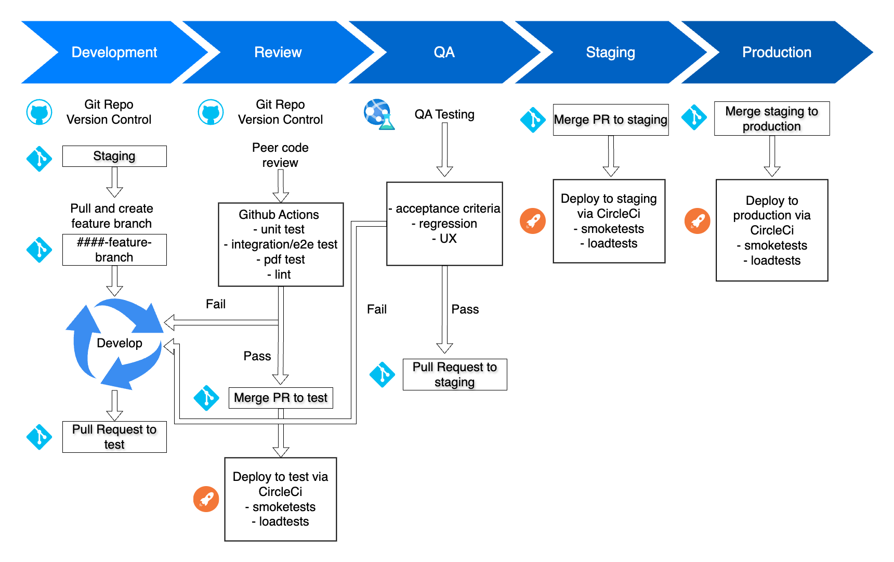

# What is DAWSON

For an overview of the project, refer to [What is DAWSON](./what-is-dawson.md).

# Running Locally

Refer to [Running Locally](./running-locally.md) to get started. If you are using VS Code, also follow the [VS Code Setup](./vscode-setup.md) instructions to get the recommended extensions and workspace settings.

# Development Lifecycle

Refer to [PR Workflow](./pr-workflow.md) for an overview of the development lifecycle.  The following diagram is a visual representation of the workflow.



# Making Changes

## Branches of Interest

Take note of the following branches.

- `upstream/test` (kept up to date with `upstream/staging`, this branch corresponds to the primary testing environment for testing and PO verification)
- `upstream/staging` (the repository's main branch; corresponds to a staging environment for the upcoming deploy; any new work branches off this branch)
- `upstream/prod` (the current version which is running on production)

?> Changes are committed to the `upstream/staging` branch which requires us to back merge changes into our in-progress branches so we are up-to-date.

?> Note that this document assumes you have chosen `upstream` as the name of your upstream for the US Tax Court fork. If you have chosen something else, say `ustaxcourt`, any reference to `upstream/{branch_name}` refers to `{upstream}/{branch_name}`.

## External Contributor

Below is a general overview of the workflow that would best prepare your contribution for inclusion in the project.

⚠️ _If you have discovered a vulnerability in DAWSON, please report it to [DAWSON support](dawson.support@ustaxcourt.gov) before creating an issue or submitting a PR. We will work with you to ensure the vulnerability is remediated before it is publicly disclosed._ ⚠️

1. Choose an issue to work on.
    - If you are interested in working on an existing issue, we ask that you only work on issues labeled:
        - `bug` - if the issue has story points
        - `design debt` - if there is no reliance on Figma (paywall)
        - `Devex` - if the issue does not also have the `feeback needed` label
    - Any issues with a reliance on TestRail or Figma are not open to external contributors, as access to those tools is limited to internal contributors. This precludes all user story (TestRail and Figma) and some design debt (Figma) issues.
    - If you are interested in working on new functionality not on the backlog, please submit a feature request to [DAWSON support](dawson.support@ustaxcourt.gov) first.
1. Branch from `upstream/staging` into a branch in your fork.
   1. How you work in your own fork is up to you, but keep in mind the public nature of the main fork.
      1. Your branch name should be professional. If working on an existing issue, the branch name must begin with the issue number.
      1. Your commit messages should be professional. If working on an existing issue, please prefix your commit messages with the issue number. For example, if you are working on issue #12345, your commit message should be prefixed with `12345 - `.
1. Work on the issue.
   1. If your work is of a nature such that testing in a deployed environment is needed, contact [DAWSON support](dawson.support@ustaxcourt.gov).
   1. While work is ongoing, other work may be merged into `upstream/staging`.  Backmerge that into your branch (and any sub-branches) so you have the latest and greatest:
      ```bash
      npm run git:backmerge-staging
      ```
1. Prior to submitting any pull requests, please perform [Pre-PR Validation](#pre-pr-validation)
1. At some point, you presume the work is done.  The work needs to be reviewed by the Court and PRs created and merged.  This can be accomplished in two ways.
   - Verification occurs in the `test` environment.
      1. Create the PR from your branch to `upstream/test`:
         ```bash
         npm run git:pr-to test
         ```
         - If there are merge conflicts refer to [Handling Merge Conflicts](#handling-merge-conflicts)
      1. Court engineering staff will respond to your PR.
      1. If the Court engineers merge your PR, do not delete your feature branch, make a PR to `upstream/staging` from your branch.
   - Verification in a deployed environment is not needed.
      1. Create the PR from your branch to `upstream/staging`.
      1. Court engineering staff will respond to your PR.
      1. If your branch is approved and merged, you have our thanks for your contribution.
1. If there is PO feedback, address the feedback on the original feature branch.  Go back to step 3.
1. If your work passes PO review, congratulations!  Create a PR from your original feature branch to `upstream/staging`.  You will need to wait for a court engineer to approve your PR and merge it.  Your code is now in `upstream/staging` and ready to fly to production on the next deployment!

?> We will be civil, but we are opinionated about the architecture and our coding standards. Refer to [Pull Request (PR) Review Process](code-review.md) for more about coding standards. We may use [emojis](https://github.com/erikthedeveloper/code-review-emoji-guide) in our comments.

?> We will expect civil behavior from contributors as well, and reserve the right to close PR's for unacceptable behavior. For more on what is considered unacceptable behavior, refer to [18F Open Source Policy GitHub repository](https://github.com/18f/open-source-policy).

## Pre-PR Validation

Please follow these steps to validate your changes before submitting a pull request:

1. Ensure you have achieved full test coverage for the code you have changed or added.
   1. Unit tests: coverage requirements are in the owning suite's `jest*.config.ts` file.
   1. Integration tests: all functionality should be covered for every applicable user role.
   1. Accessibility tests: all user-facing functionality should be covered by an accessibility test that calls `checkA11y()`.
1. Start the application locally, utilizing one of the following methods:
   - invoking the ▶️ `DAWSON local` run configuration in your IDE as described in [Debugging Locally](./debugging-locally.md)
   - running the following commands in three separate terminal sessions:
      1. API:
         ```bash
         npm run start:api
         ```
      1. Private Client:
         ```bash
         npm run start:client
         ```
      1. Public Client:
         ```bash
         npm run start:public
         ```
   - prompting an AI agent:
      ```markdown
      Please start all three DAWSON processes locally in the `.devcontainer` as described in `AGENTS.md`.
      ```
1. With the application running, run the following scripts, ensuring no failures:
   1. API Unit Tests:
      ```bash
      npm run test:api
      ```
   1. Client Integration Tests:
      ```bash
      npm run test:client:integration:ci
      ```
   1. Client Unit Tests:
      ```bash
      npm run test:client:unit
      ```
   1. Cypress Integration Tests:
      ```bash
      npm run cypress:integration
      ```
   1. Cypress Public Integration Tests:
      ```bash
      npm run cypress:integration:public
      ```
   1. Cypress Smoke Tests:
      ```bash
      npm run cypress:smoketests
      ```
   1. Cypress Read-Only Tests:
      ```bash
      npm run cypress:readonly
      ```
   1. Cypress Public Read-Only Tests:
      ```bash
      npm run cypress:readonly:public
      ```
   1. Shared Unit Tests:
      ```bash
      npm run test:shared
      ```
   1. Scripts Unit Tests:
      ```bash
      npm run test:scripts
      ```
1. If you use an AI Agent, prompt the agent to conduct a code review of all changes utilizing the "Code Review Guidelines" in [AGENTS.md](../AGENTS.md):
   ```markdown
   The objective of the work in the local branch is {summarize the changes}.

   The acceptance criteria are:
     - {list the acceptance criteria}

   Please review all changes in the local branch against `upstream/staging` utilizing the code review guidelines in `AGENTS.md`, ensuring that all acceptance criteria are met and that no regressions are introduced.

   Run all relevant tests, utilizing the test suite identification instructions in `AGENTS.md`, and ensure sufficient coverage for all added and modified code.
   ```

## Handling Merge Conflicts

In order to keep untested `upstream/test` changes out of your feature branch, PRs to test should be made from an intermediary branch that will contain the resolved merge conflicts. We provide a [convenience script](../scripts/git/pr-to.sh) for creating PRs to `upstream/test` that will automatically create the intermediary branch.

This is the "happy path" for PRs created with the convenience script:

1. Checks out the latest `upstream/test`
1. Creates a new intermediary branch, based on the checkout of `upstream/test`, called `{feature-branch}-to-test-{timestamp}`
1. Merges the feature branch into the new intermediary branch
1. Pushes the intermediary branch to the fork
1. Opens the browser at the GitHub branch comparison page, comparing the intermediary branch to `upstream/test`

If merge conflicts are encountered, however, the script will stop between steps 3 and 4. At this point you will need to resolve the merge conflicts locally. After resolving the merge conflicts, you will need to perform the rest manually:

1. Determine your org name and the intermediary branch name
   ```bash
   export MY_ORG="$(git config --get remote.origin.url | sed -E 's/.*github\.com[:\/]([^\/]+).*/\1/')"
   export INTERMEDIARY="$(git branch --show-current)"
   ```
1. Stage and commit the merge conflict resolution(s) to the intermediary branch
   ```bash
   git add .
   git commit -m "Concise message describing the merge conflict resolution"
   ```
1. Push the intermediary branch to your fork
   ```bash
   git push --set-upstream origin "$INTERMEDIARY"
   ```
1. Open the browser at the GitHub branch comparison page, comparing the intermediary branch to `upstream/test`
   ```bash
   open "https://github.com/ustaxcourt/ef-cms/compare/test...${MY_ORG}:${INTERMEDIARY}"
   ```
