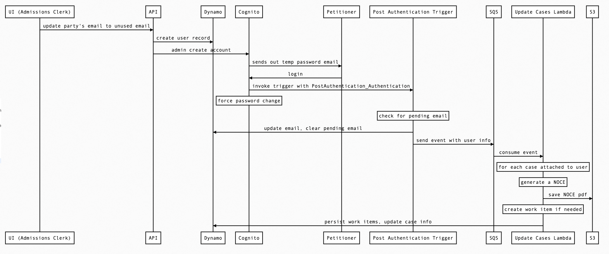

```
UI (Admissions Clerk)->API: update party's email to unused email
API->Dynamo: create user record
API->Cognito: admin create account
Cognito->Petitioner: sends out temp password email
Petitioner->Cognito: login
Cognito->Post Authentication Trigger: invoke trigger with PostAuthentication_Authentication
note over Cognito: force password change
note over Post Authentication Trigger: check for pending email
Post Authentication Trigger->Dynamo: update email, clear pending email
Post Authentication Trigger->SQS: send event with user info
SQS->Update Cases Lambda: consume event
note over Update Cases Lambda: for each case attached to user
note over Update Cases Lambda: generate a NOCE
Update Cases Lambda->S3: save NOCE pdf
note over Update Cases Lambda: create work item if needed
Update Cases Lambda->Dynamo: persist work items, update case info
```

