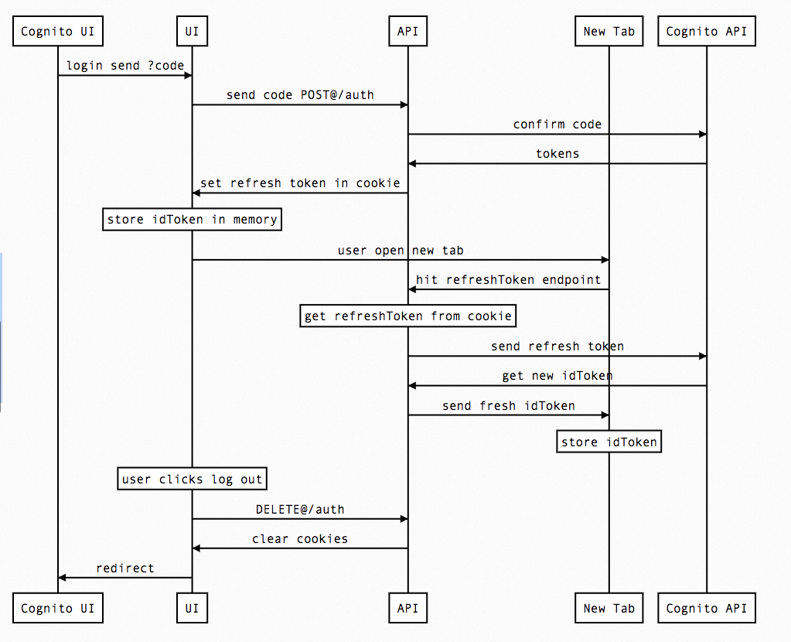

```
participant Cognito UI
participant UI
participant API
participant New Tab
participant Cognito API
Cognito UI->UI: login send ?code
UI->API: send code POST@/auth/login
API->Cognito API: confirm code
Cognito API->API: id token & refresh token
API->UI: id token in response body & refresh token in cookie
note over UI: store id token in memory
UI->New Tab: user open new tab
New Tab->API: hit POST@/auth/refresh
note over API: get refresh token from cookie
API->Cognito API: send refresh token
Cognito API->API: get new id token
API->New Tab: send new id token in response body
note over New Tab: store id token in memory
note over UI: user clicks log out
UI->New Tab: broadcast logout
New Tab->Cognito UI: redirect
UI->API: DELETE@/auth/login
API->UI: expire cookie
UI->Cognito UI: redirect
```


