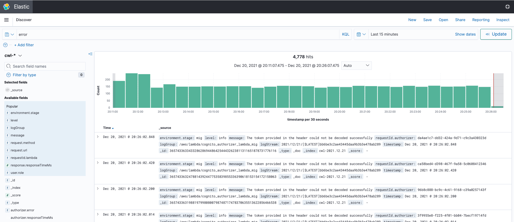

# Kibana

This part of the documentation explains how we use Kibana to manage our logs and debug various issues that come up in production.

> The Kibana URL for the lower Tax Court environments can be found [here](https://search-info-xw4ehxtswfeh63wmz4srpbkf3u.us-east-1.es.amazonaws.com/_plugin/kibana/).  You'll need to ask the Tax Court's tech lead to make you an account if you want access.

We recommend watching through this short video to get a better understanding of how Kibana can be used to search through logs and also how it is deployed in our system via Terraform.

<iframe width="560" height="315" src="https://www.youtube.com/embed/WV-OpNFnJy0" title="YouTube video player" frameborder="0" allow="accelerometer; autoplay; clipboard-write; encrypted-media; gyroscope; picture-in-picture" allowfullscreen></iframe>

## What is Kibana

Kibana is a an open source tool which supports visualization of logs, advanced searching, filtering, etc.  It's important for debugging production issues in Dawson.  Sometimes you need to understand how a case got into a particular bad state and the only way to achieve that is to search through requests made by a particular user against a certain docket number and trace through the change log.

It's also useful for getting insight into feature usage.  You can easily create graphs that map the number of requests to an API endpoint, and you can also track how long these endpoints took to run if needed.

# How it's Set Up

We use Terraform to deploy all of our infrastructure.  When we set up our infrastructure, an AWS Opensearch (formerly Elasticsearch) cluster called `info` is created via the Terraform code found in the `iam/terraform/account-specific` directory.  This code contains all of our global account specific infrastructure, including any global IAM policies and Kibana.  In order to run this Terraform setup, a user with AWS admin access would run `npm run account-specific` which creates everything needed to get Kibana running.

The account specific Terraform code will also set up a Lambda function which will forward logs to our cluster; read through [lambda-logs-to-elasticsearch.tf](https://github.com/ustaxcourt/ef-cms/blob/staging/iam/terraform/account-specific/main/lambda-logs-to-elasticsearch.tf) for more information on how our Lambda and cluster are hooked up.  The Kibana instance is authenticated via Cognito, so you'd need to setup a user in the `log_viewer` found on the [aws cognito](https://console.aws.amazon.com/cognito/users/?region=us-east-1#/?_k=wg53yp) dashboard in order to access the Kibana dashboard.

As our API lambdas generate logs into Cloudwatch, the log forwarding lambda will parse the logs and forward them to the `info` cluster so that Kibana can display the logs.

## How to Search

Searching in Kibana is pretty simple.  The following screenshot pinpoints the major widgets you will be interacting with while searching.

1. Search Bar - This is where you type the piece of information you are interested in finding in the logs.  Usually you'd type in part of the string that was output via an `applicationContext.logger.error` call. Sometimes you need to write your query in double quotes `"an error occurred"` if you want an exact match, because by default Elasticsearch will tokenize your request and find partial matches.  The query you enter will also be run against other fields, not just the log message.  For example, searching for `test` will return all results that have the property of `environment.stage: test`.  You can search multiple terms by using the `AND` keyword, such as `test AND green` which will return you all requests on the test environment against the green API.

2. Date Filter - often you want to filter by a specific date.  Sometimes we'll get a bug report that occurred 3 weeks ago on a Friday, so often you'll want to click the date dropdown and change it to an absolute date range to find all the logs associated with that day.

3. Results Histogram - this graph is a histogram of logs vs time.  You are able to zoom in by clicking and dragging over a region of the graph which is useful if you see a spike of logs over a certain period (which often results to a collection of errors).  Zooming in will affect the logs displayed in `section 4`.

4. Individual Logs - this section contains a list of all the individual logs which you can click to expand and view more metadata about the log event.  You'll often want to expand the log to look at the message, stage, timestamp, user, etc.

5. Column View - you can click properties on this section to change the display of the `section 4 - individual logs` to a more easily viewable table with the columns you've picked.

6. Filters - This section allows you to add filters to your search.  For example, often you want to filter by an environment or a user who made the request.