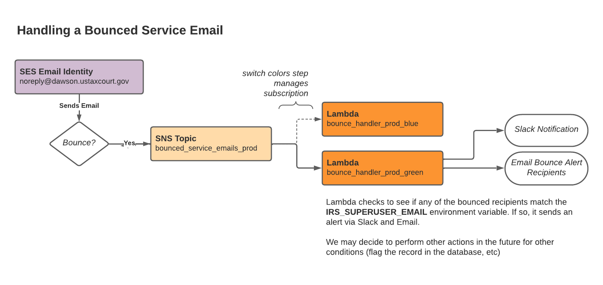

# Bounced Email Notifications

## Problem

Occasionally, service Email bounces and we may need to take programmatic action when such an event occurs. Specifically, if the bounce was the result of an email to the `IRS_SUPERUSER_EMAIL` account, we need to take immediate action by alerting Court personnel and a distribution list.

## Solution

We have introduced an SES Identity Notification Topic that will send notifications of Bounces to an SNS Topic. The Notification Topic is tied to the SES Sender identity (`noreply@EFCMS_DOMAIN`). This allows us to manage this on a per environment basis. It only fires for **Bounce** events, limiting the scope of this solution. It ignores **Delivery** and **Complaint** notifications, at least for now.

Each of these notifications get sent to an SNS Topic that is environment specific.

A Lambda subscribed to that topic calls `handleBounceNotificationInteractor` to process each SNS message it receives.

This interactor checks to see if the Bounced Email was to sent to the `IRS_SUPERUSER_EMAIL` and whether or not it is has a "Permanent" `bounceType`. If so, it will trigger a POST call via the Application's HTTP Client to the webhook specified in the environment variable `SLACK_WEBHOOK_URL`. It will also send an Email to any email addresses specified via a comma-delimited string in `BOUNCE_ALERT_RECIPIENTS`.

## Future Considerations

We could send all notifications (Bounce, Delivery, and Complaint) for more advanced handling.

Perhaps we want to record somewhere in the Docket Entry what users received the Email and for whom it may have bounced. Or perhaps we would like to take action when Bounces or Complaint events happen for petitioners and practitioners (creating work items to address the Bounce or Complaint). This sets up the scaffolding for this future possibility.

## Manual Steps

The environment specific terraform needs to be run in order to enable permissions for the Lambda to subscribe to the Topic.
