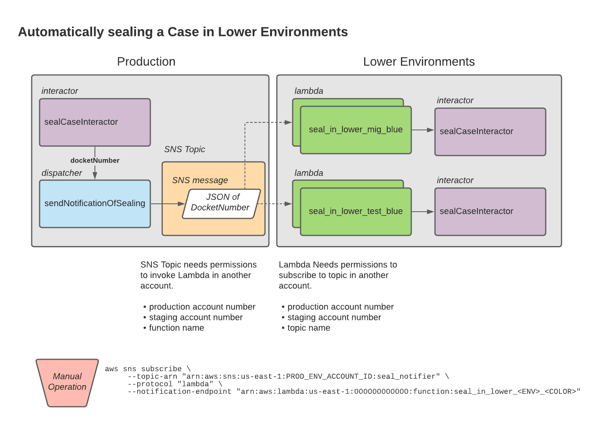

# Sealing Items in Lower Environments

## Problem

Sealed cases in production remain unsealed in Lower Environments that have Production data

## Solution



Two new environment variables are introduced that inform Terraform whether to create the SNS Topic, the Lambdas that subscribe to the SNS Topic, or none of the above.

If you don't need to worry about sealing cases in lower environments, simply do not specify any of the environment variables in CircleCI. Terraform will not create the SNS Topic nor the Lambdas. However, if you would like to create the resources in order to seal cases in lower environments, in CircleCI, be sure to specify the `PROD_ENV_ACCOUNT_ID` with the AWS Account ID where the Production environment lives. Additionally specify the `LOWER_ENV_ACCOUNT_ID` with the AWS Account ID where lower environments live. These two cannot be the same.

### In Production

The `sealCaseInteractor` makes a call to a new dispatcher that has been made available in the codebase. This dispatcher, `sendNotificationOfSealing`, only runs if the current environment is production. If the environment is not production, it does nothing.

This dispatcher publishes a message to an SNS topic called `seal_notifier` that also only exists in production. Its message is simply the `docketNumber` in a stringified JSON object. When we are [able to seal individual documents](https://github.com/flexion/ef-cms/issues/4252), we may opt to also include a `docketEntryId` in order to seal that document in a lower environment.

This SNS topic is [built with Terraform](../../web-api/terraform/template/sns-sealed-cases.tf), and we calculate whether or not to create it by comparing the `AWS_ACCOUNT_ID` with a new environment variable `PROD_ENV_ACCOUNT_ID`. If they match, we create one that belongs to the entire account. If not, we do not create the topic.

```terraform
resource "aws_sns_topic" "seal_notifier" {
  name = "seal_notifier"
  count = var.prod_env_account_id == data.aws_caller_identity.current.account_id ? 1 : 0
}

```

The terraform config also permits a specified lambda in a lower environment to subscribe to it. Another newly introduced environment variable `LOWER_ENV_ACCOUNT_ID` is used to generate the `sns_topic_policy` that grants access to those lambda functions.

## In the Lower Environments

In any environment that is not production, a new lambda named `seal_in_lower` is created to subscribe to the SNS topic above. These lambdas are only created if the `AWS_ACCOUNT_ID` matches the `LOWER_ENV_ACCOUNT_ID`.

Since it needs to make use of the `applicationContext` and seal cases via the `sealCaseInteractor`, we make a esbuild bundle for it, include it in the build step, and deploy it via the `blue`/`green` template.

We need to make use of the `PROD_ENV_ACCOUNT_ID` in order to grant the ability to invoke this function to the `seal_notifier` topic, and we include that as an `aws_lambda_permission` in the [terraform configuration for the lambda](../../web-api/terraform/api/seal-in-lower-environment.tf).

## Establishing the connection

Once this is deployed, in order to subscribe to the topic, we need to manually perform these operations for any environment that has production data:

```
aws sns subscribe \
    --topic-arn "arn:aws:sns:us-east-1:<PROD_ENV_ACCOUNT_ID>:seal_notifier" \
    --protocol "lambda" \
    --notification-endpoint "arn:aws:lambda:us-east-1:<LOWER_ENV_ACCOUNT_ID>:function:seal_in_lower_dev_blue"
aws sns subscribe \
    --topic-arn "arn:aws:sns:us-east-1:<PROD_ENV_ACCOUNT_ID>:seal_notifier" \
    --protocol "lambda" \
    --notification-endpoint "arn:aws:lambda:us-east-1:<LOWER_ENV_ACCOUNT_ID>:function:seal_in_lower_dev_blue"
```

We subscribe both the `blue` and `green` lambda functions to the topic. As it executes, the lambda retrieves the currently deployed color, and only the lambda of the currently deployed color will respond to the notification.

## Dispatcher

This introduces a new dispatcher that is available to the applicationContext object  via `.getDispatchers().sendNotificationOfSealing()`.

This dispatcher makes use of another new service to the applicationContext, AWS SNS, which itself is newly available via `.getNotificationService()`.
