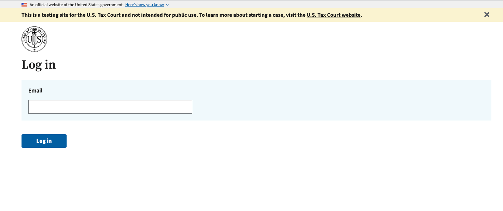

# Running Dawson Locally

So by now, hopefully you've logged in to a deployed Dawson environment, played around uploading a petition as the *petitioner1@example.com* user, and maybe even served that petition as the *petitionsclerk2@example.com* user.  Now it's time to figure out how you can run this application locally so that you can start contributing to the project.

## Prerequisites

!> We try to update versions of our software as often as we can, so double check with the team to verify these docs are accurate.

### Git

Download and install [git](https://git-scm.com/downloads).  We use GitHub as our source control.

After installing git, be sure to clone the project locally:

`git clone git@github.com:flexion/ef-cms.git`

### Node v20.12.1

All of our application code is built using Javascript:

- Our frontend is written React, Cerebral, and bundled using esbuild.
- Our backend APIs are written using express and a serverless wrapper.

Because of this, you will need to make sure you node and npm installed locked to the following versions:
    - Node v20.12.1
    - npm v10.5.0

As of May 2022, AWS Lambda only supports up to [`nodejs20.x`](https://docs.aws.amazon.com/lambda/latest/dg/lambda-runtimes.html)

### Java 11+

You will need Java installed in order to run **[elasticsearch](https://www.elastic.co/)** and **[dynamodb](https://docs.aws.amazon.com/amazondynamodb/latest/developerguide/DynamoDBLocal.DownloadingAndRunning.html)** locally on your machine.  Grabbing the latest version of Java JDK should work fine.

### JQ

JQ is a tool used for parsing JSON in the command line.  We use JQ a lot in various deployment scripts.

`brew install jq`

### Shellcheck

Shellcheck is a tool we run locally against our .sh scripts to check for potential issues and keep the styling consistent.  You can install it with brew:

`brew install shellcheck`

### AWS CLI

The AWS CLI is again used for a majority of our deployment scripts.  You can follow this [tutorial](https://docs.aws.amazon.com/cli/latest/userguide/getting-started-install.html) to get the AWS CLI v2 installed on your laptop.

### Terraform

We recommend you install a tool called [tfenv](https://github.com/tfutils/tfenv) which can be used to easily switch your terraform version.  

```bash
brew install tfenv
tfenv install 1.1.0
tfenv use 1.1.0
```

!> Before running terraform on your workspace, double check you are on the correct version.

### Circleci

Since we use circle ci in our CI/CD process, we using a husky pre-commit to validate our config file.  Because of this, you'll need to install this circleci package.

```bash
brew install circleci
```

## Getting Running

All of the scripts needed to run this project should be outlined in our [package.json](https://github.com/ustaxcourt/ef-cms/blob/staging/package.json#L162).  I recommend looking through this list of scripts because you will be using a lot of them as you advance through learning this application.  But for now, let's just talk about the most important ones.

### M1 Macs - Docker Method

#### Additional Prerequisites

[Docker Desktop](https://www.docker.com/products/docker-desktop/). Ask a team member how to obtain a license if you don't already have one. **If you use Docker Desktop, you need to get a license**. Within Docker, allocate 2+ CPUs, 8+ GB of RAM, and 4+ GB of swap. This will reduce the number of resource-related failures when running the application.

#### Checkout Develop

Make sure you are on the `ustaxcourt/staging` branch before you try to start the services.

#### 💻 MacOS Monterey+

There is a conflict on `port 5000` with the public API and AirPlay Receiver.

Disable AirPlay Receiver: System Preferences --> Sharing --> Uncheck "AirPlay Receiver" in the list.

#### Starting the Services

You don't need to install any NPM dependencies before running the script:

`npm run start:all:docker`. This script handles NPM dependency installation and starting the API, the client UI, and the public UI.

Once you've started your services locally, you should be able to access them here:

- [http://localhost:1234](http://localhost:1234) (private UI)
- [http://localhost:5678](http://localhost:5678) (public UI)

Use one of the mock logins documented below to log in to the private UI.



If you have unexpected errors with running in Docker, try allocating 2+ CPUs, 8+ GB of RAM, and 4+ GB of swap.

### M1 Macs - Non-Docker Method

This method does not use Docker, nor does it use Rosetta. It is also the method preferred by other M1 users on the team.

Follow the instructions for setup as you would for Non-M1 Macs, but **before you run `npm i`**, run the following commands:

```sh
brew install pkg-config cairo pango libpng jpeg giflib librsvg pixman libffi expat zlib
brew link libffi --force
brew link expat --force
brew link zlib --force
export PKG_CONFIG_PATH=/opt/homebrew/lib/pkgconfig/ 
```

This will install `node-canvas` dependencies globally. As of 12/05/2022, `node-canvas` does not have a package compatible with M1 Macs.

### Non-M1 Macs

#### Checkout Develop

Make sure you are on the `ustaxcourt/staging` branch before you install the npm dependencies or try to start the services.

#### Install the NPM Depedencies

All applications dependencies are managed via our `package.json` and `package-lock.json` files and are installed using `npm`.  You will first need to install of our dependencies by running the following:

`npm install`

#### 💻 MacOS Monterey+

There is a conflict on `port 5000` with the public API and AirPlay Receiver.

Disable AirPlay Receiver: System Preferences --> Sharing --> Uncheck "AirPlay Receiver" in the list.

#### 🏃 Starting the Services

Once you've installed the dependencies, you should be able to run the npm scripts to start up the API, private UI, and public UI.  We recommend you have three separate terminals open and run each of the following commands in a separate terminal:

- `npm run start:client` (starts the private UI)
- `npm run start:public` (starts the public UI)
- `npm run start:api` (starts the private API and public API)

Once you've started your services locally, you should be able to access them here:

- [http://localhost:1234](http://localhost:1234) (private UI)
- [http://localhost:5678](http://localhost:5678) (public UI)

Use one of the mock logins documented below to log in to the private UI.


## How to Login Locally

Now that your application is running locally, try to log in with some of the local mock user accounts.  All of these users are defined in [users.json](https://github.com/ustaxcourt/ef-cms/blob/staging/web-api/storage/fixtures/seed/users.json), and also in [efcms-local.json](https://github.com/ustaxcourt/ef-cms/blob/staging/web-api/storage/fixtures/seed/efcms-local.json) which contains all of our dynamodb seed data.

Open a browser to [http://localhost:1234](http://localhost:1234) and enter one of the following mock user emails.

?> Use the password `Testing1234$` for logins during local development.

```txt
petitioner@example.com
privatePractitioner@example.com
irspractitioner@example.com
irssuperuser@example.com
adc@example.com
admissionsclerk@example.com
clerkofcourt@example.com
docketclerk@example.com
docketclerk1@example.com
floater@example.com
general@example.com
petitionsclerk@example.com
petitionsclerk1@example.com
reportersoffice@example.com
trialclerk@example.com
judge.ashford@example.com
ashfordschambers@example.com
judge.buch@example.com
buchschambers@example.com
stjudge.carluzzo@example.com
carluzzoschambers@example.com
judge.cohen@example.com
cohenschambers@example.com
judge.colvin@example.com
colvinschambers@example.com
```

## Troubleshooting

Hopefully everything will work fine, but if you have issues logging in, double check that your API didn't throw errors when trying to initialize.  Check your network tab or browser console for any errors when trying to access the localhost:4000 API.  Also verify you are on the correct branch. `ustaxcourt/staging` is recommended.
