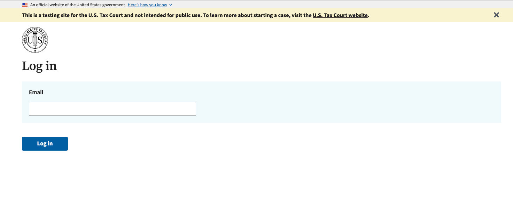

# Running Dawson Locally

So by now, hopefully you've logged in to a deployed Dawson environment, played around uploading a petition as the *petitioner1@example.com* user, and maybe even served that petition as the *petitionsclerk2@example.com* user.  Now it's time to figure out how you can run this application locally so that you can start contributing to the project.

## ⚠️ Caution ⚠️

- Proceed with the expectation that this documentation is out of date.
- Carefully inspect every command before running.
- Update this documentation as necessary.

## Install Required Software

### Command-line software

To run a DAWSON development environment, we will need to install the following CLI tools:

- [Homebrew](https://brew.sh/) - package manager for macOS
- [Git](https://git-scm.com/downloads) - our version control system
- [NVM](https://github.com/nvm-sh/nvm) - version manager for Node.js
- [OpenJDK](https://openjdk.org/) - Java runtime
- [JQ](https://stedolan.github.io/jq/) - command-line JSON processor
- [Shellcheck](https://www.shellcheck.net/) - static analysis tool for shell scripts
- [AWS CLI](https://docs.aws.amazon.com/cli/latest/userguide/getting-started-install.html) - command-line interface for AWS
- [TFSwitch](https://tfswitch.warrensbox.com/) - version manager for Terraform
- [Circleci](https://circleci.com/docs/2.0/local-cli/) - command-line interface for CircleCI
- [OAthToolkit](https://oath-toolkit.codeberg.page/) - command-line tools for OAuth 2.0
- [LibPQ](https://www.postgresql.org/docs/current/libpq.html) - command-line interface for PostgreSQL
- [GH](https://cli.github.com/) - command-line interface for GitHub
- [Docker](https://docs.docker.com/get-started/) - Docker is an open platform for developing, shipping, and running applications.
- [Docker Compose](https://docs.docker.com/compose/) - Docker Compose is a tool for defining and running multi-container applications.

**Homebrew**

1. Run the installation command on the [Homebrew website](https://brew.sh/) to install Homebrew
1. Perform the post-installation steps indicated in the script's output
1. Verify that Homebrew is installed:
   ```bash
   brew --version
   ```


**Other CLI tools**

1. Now that homebrew is installed, you can use it to install the other CLI tools:
   ```bash
   brew update
   brew install git \
     nvm \
     openjdk \
     jq \
     shellcheck \
     awscli \
     warrensbox/tap/tfswitch \
     circleci \
     oath-toolkit \
     libpq \
     gh
   ```
1. Several of the installed packages will output some post-installation steps. Follow those instructions to complete the installation.
1. ⚠️ Apple Silicon Macs Only ⚠️
   1. Apple Silicon Macs require some additional software to be installed.  Run the following commands to install and configure the necessary dependencies:
      ```sh
      brew install pkg-config cairo pango libpng jpeg giflib librsvg pixman libffi expat zlib
      brew link libffi --force
      brew link expat --force
      brew link zlib --force
      ```
   1. This will install `node-canvas` dependencies globally.

### Graphical User Interface (GUI) software

We will also need to install the following GUI tools:

- [Visual Studio Code](https://code.visualstudio.com/) - integrated development environment (IDE)
- [Table Plus](https://tableplus.com/) - database management GUI tool
- [Gather](https://gather.town) - virtual office space
- [Docker Desktop](https://www.docker.com/products/docker-desktop/) - containerization software
- [Pop](https://pop.com/) - pair programming tool
- [Slack](https://slack.com/) - team communication tool

## Getting Running

All of the scripts needed to run this project should be outlined in our [package.json](https://github.com/ustaxcourt/ef-cms/blob/staging/package.json#L162).  I recommend looking through this list of scripts because you will be using a lot of them as you advance through learning this application.  But for now, let's just talk about the most important ones.

### Checkout `staging`

Make sure you are on the `ustaxcourt/staging` branch before you install the npm dependencies or try to start the services.

### Install Node.js via NVM

We use [NVM](https://github.com/nvm-sh/nvm) to manage our Node.js versions. The exact version of Node.js we use is defined in the [.nvmrc](https://github.com/ustaxcourt/ef-cms/blob/staging/.nvmrc) file. The version specified in this file will be used when running `nvm install` and `nvm use` without specifying a version.

```sh
nvm install
nvm use
nvm alias default "$(cat .nvmrc)"
```

### Install NPM Dependencies

All application dependencies are managed via our `package.json` and `package-lock.json` files and are installed using `npm`.  You will first need to install of our dependencies by running the following:

`npm ci`

Note: ef-cms includes `@ustaxcourt/payment-portal` and `@ustaxcourt/pay-gov-test-server` as devDependencies to support payment portal / Pay.gov integration development and testing. See [Dependency Updates](./dependency-updates.md) for Node.js version upgrade guidance and compatibility considerations for `@ustaxcourt/payment-portal`. See below for how to run `@ustaxcourt/pay-gov-test-server`

### 🏃 Starting the Services

Once you've installed the dependencies, you should be able to run the npm scripts to start up the API, private UI, and public UI.  We recommend you have three separate terminals open and run each of the following commands in a separate terminal:

- `npm run start:client` (starts the private UI)
- `npm run start:public` (starts the public UI)
- `npm run start:api` (starts the private API and public API)

Once you've started your services locally, you should be able to access them here:

- [http://localhost:1234](http://localhost:1234) (private UI)
- [http://localhost:5678](http://localhost:5678) (public UI)

Use one of the mock logins documented below to log in to the private UI.



## How to Login Locally

Now that your application is running locally, try to log in with some of the local mock user accounts.  All of these users are defined in [users.json](https://github.com/ustaxcourt/ef-cms/blob/staging/web-api/storage/fixtures/seed/users.json), and also in [efcms-local.json](https://github.com/ustaxcourt/ef-cms/blob/staging/web-api/storage/fixtures/seed/efcms-local.json) which contains all of our seed data.

Open a browser to [http://localhost:1234](http://localhost:1234) and enter one of the following mock user emails.

?> Use the password `Testing1234$` for logins during local development.

```txt
petitioner@example.com
privatePractitioner@example.com
irspractitioner@example.com
irssuperuser@example.com
adc@example.com
admissionsclerk@example.com
clerkofcourt@example.com
docketclerk@example.com
docketclerk1@example.com
floater@example.com
general@example.com
petitionsclerk@example.com
petitionsclerk1@example.com
reportersoffice@example.com
trialclerk@example.com
judge.ashford@example.com
ashfordschambers@example.com
judge.buch@example.com
buchschambers@example.com
stjudge.carluzzo@example.com
carluzzoschambers@example.com
judge.cohen@example.com
cohenschambers@example.com
judge.colvin@example.com
colvinschambers@example.com
```

## Troubleshooting

Hopefully everything will work fine, but if you have issues logging in, double check that your API didn't throw errors when trying to initialize.  Check your network tab or browser console for any errors when trying to access the localhost:4000 API.  Also verify you are on the correct branch. `ustaxcourt/staging` is recommended.

## Debugging the Application

When you are ready to set breakpoints and debug the application, see [Debugging Locally with an IDE](./debugging-locally.md) for instructions on using integrated run configurations to run and debug the application in JetBrains IDEs or VSCode.

## Running the USTC pay.gov test server

When testing interactions with pay.gov locally or in a pipeline, the USTC pay.gov test server needs to be started. The test server has been installed as a dev dependency. To run it, use the following command: 

```
npm run start:pay-gov-test-server
```

When initially running the server with this command, you will be prompted to enter a port for the test server to run on and an access token that will authenticate requests with the test server. To update these variables, run the following command:

```
npm run start:pay-gov-test-server:update-env
```

For further information, please see the [readme](https://www.npmjs.com/package/@ustaxcourt/ustc-pay-gov-test-server) for this repo. 