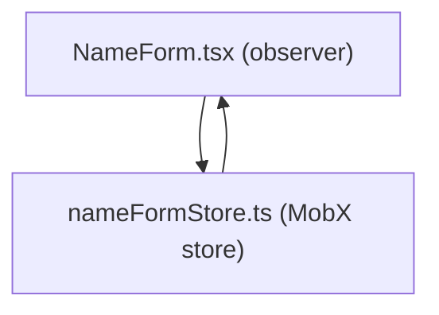

# Direct Migration to MobX With Imperative Workflows

## Overview

The tool or tools that replace Cerebral will need to account for both:

- Traditional state access patterns like getter, setter, and derived state calculations
- Workflow orchestration of some sort

This document contains an example design of how MobX could be used to handle state access, while workflows are simply imperative functions with conditional logic in React event handlers or standalone utility functions.

## Example Implementation using MobX

> **Note**: This stripped-down reference implementation demonstrates core concepts. In a real-world system, you would want additional considerations such as error boundaries, asynchronous actions, type safety, and thorough testing.

### Defining the Store

```typescript
// nameFormStore.ts
import { makeAutoObservable } from 'mobx';

class NameFormStore {
  name = '';

  constructor() {
    // `makeAutoObservable` transforms this into a reactive store
    // so that any MobX-based observer will re-render on state changes.
    makeAutoObservable(this);
  }

  setName(name: string) {
    this.name = name;
  }

  resetForm() {
    this.name = '';
  }
}

// Export a singleton store instance for easy import in components
export const nameFormStore = new NameFormStore();

// NameForm.tsx
import React from 'react';
import { observer } from 'mobx-react-lite';
import { nameFormStore } from './nameFormStore';

export const NameForm = observer(() => {
  const { name, setName, resetForm } = nameFormStore;

  const handleSubmit = (e: React.FormEvent) => {
    e.preventDefault();

    if (name.trim()) {
      alert(`Name submitted: ${name}`);
      resetForm();
    } else {
      alert('Please enter a name.');
    }
  };

  return (
    <form onSubmit={handleSubmit}>
      <input
        type="text"
        value={name}
        onChange={(e) => setName(e.target.value)}
      />
      <button type="submit">Submit</button>
    </form>
  );
});
```
1. Define a Store: Create a NameFormStore class to store the form data. makeAutoObservable makes its properties and methods reactive.
2. Use the Store: The component imports the store and reads from or writes to its properties. observer automatically re-renders the component when any observable value changes.
3. Imperative Workflow: Here, the form’s "workflow" is an event handler that checks if the user has entered a valid name, shows an alert, and resets the store.


## Pros and Cons of Approach
Pros:

- Simple Mental Model: Imperative functions are straightforward to implement and maintain for smaller or less complex workflows
- Automatic Reactivity: MobX tracks which components rely on specific pieces of state, handling re-renders similarly to Cerebral connect
- Minimal Boilerplate: makeAutoObservable reduces the need for extra configuration or action definitions

Cons:

- Loss of Declarative Workflow Orchestration: As workflows grow more complex, scattering logic in multiple event handlers or utility functions can become cumbersome.
- Manual Error Handling: Developers must handle all error scenarios in each workflow function.
- Potential Overuse of a Single Store: If too many concerns end up in one MobX store, the code can become difficult to maintain over time.
