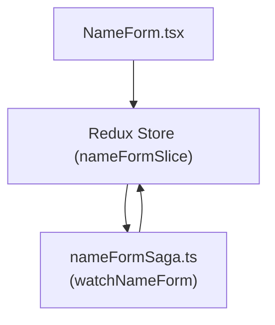

# Direct Migration to Redux and Redux-Saga With Imperative Workflows

## Overview

The tool or tools that replace Cerebral will need to account for both:

- Traditional state access patterns like getter, setter, and derived state calculations  
- Workflow orchestration of some sort  

This document provides an example design of how Redux can manage a global state, and how Redux-Saga can coordinate asynchronous or complex workflows. In this example, business logic remains largely imperative (using simple functions or Redux-Saga generators) triggered by React event handlers.

## Example Implementation

> **Note**: The following code focuses on core concepts in a simplified way. In a production environment, you would include best practices such as thorough testing, error handling, advanced typing, and robust Redux configuration.

### 1. Defining the Store and Saga

#### nameFormSlice.ts

```typescript
// nameFormSlice.ts
import { createSlice, PayloadAction } from '@reduxjs/toolkit';

interface NameFormState {
  name: string;
}

const initialState: NameFormState = {
  name: '',
};

const nameFormSlice = createSlice({
  name: 'nameForm',
  initialState,
  reducers: {
    setName(state, action: PayloadAction<string>) {
      state.name = action.payload;
    },
    resetForm(state) {
      state.name = '';
    },
    submitName(_state, _action: PayloadAction<string>) {
      // This action is handled by a saga, so no state update here.
    },
  },
});

export const { setName, resetForm, submitName } = nameFormSlice.actions;

export const nameFormReducer = nameFormSlice.reducer;
```
1. createSlice: Redux Toolkit’s createSlice function simplifies the process of defining a reducer, its actions, and the initial state.
2. Actions: setName, resetForm, and submitName are automatically generated. The submitName action is a placeholder for asynchronous or more complex logic to be handled by a saga.

```typescript 
// nameFormSaga.ts
import { takeLatest, call, put } from 'redux-saga/effects';
import { submitName, resetForm } from './nameFormSlice';

// Example of an async function that might send a network request
function* submitNameEffect(action: ReturnType<typeof submitName>) {
  try {
    const name = action.payload;
    // In a real-world scenario, you might do something like:
    // yield call(api.submitName, name);

    // For this example, simulate a side effect:
    yield call(() => new Promise(res => setTimeout(res, 500)));

    // Show an alert once the submission is "done"
    alert(`Name submitted: ${name}`);
    yield put(resetForm());
  } catch (error) {
    alert('Something went wrong with the name submission!');
  }
}

export function* watchNameForm() {
  // Listen for `submitName` actions
  yield takeLatest(submitName.type, submitNameEffect);
}
```
1. Saga: Redux-Saga uses generator functions to handle side effects.
2. Actions: The saga listens for submitName actions and runs the submitNameEffect generator when those actions are dispatched.
3. Side Effects: The call effect can invoke asynchronous functions. In this example, we simulate a short delay before showing an alert and resetting the form.

```typescript
// store.ts
import { configureStore } from '@reduxjs/toolkit';
import createSagaMiddleware from 'redux-saga';
import { nameFormReducer } from './nameFormSlice';
import { watchNameForm } from './nameFormSaga';

const sagaMiddleware = createSagaMiddleware();

export const store = configureStore({
  reducer: {
    nameForm: nameFormReducer,
  },
  middleware: (getDefaultMiddleware) =>
    getDefaultMiddleware({ thunk: false }).concat(sagaMiddleware),
});

sagaMiddleware.run(watchNameForm);

// Export the store's type for convenience
export type AppDispatch = typeof store.dispatch;
export type RootState = ReturnType<typeof store.getState>;
```
1. configureStore: Redux Toolkit’s recommended function for setting up the store.
2. Saga Middleware: We attach redux-saga to the Redux store so our sagas can intercept dispatched actions.

```typescript
// NameForm.tsx
import React from 'react';
import { useSelector, useDispatch } from 'react-redux';
import { RootState, AppDispatch } from './store';
import { setName, submitName } from './nameFormSlice';

export const NameForm: React.FC = () => {
  const dispatch = useDispatch<AppDispatch>();
  const name = useSelector((state: RootState) => state.nameForm.name);

  const handleSubmit = (e: React.FormEvent) => {
    e.preventDefault();
    if (name.trim()) {
      dispatch(submitName(name));
    } else {
      alert('Please enter a name.');
    }
  };

  return (
    <form onSubmit={handleSubmit}>
      <input
        type="text"
        value={name}
        onChange={(e) => dispatch(setName(e.target.value))}
      />
      <button type="submit">Submit</button>
    </form>
  );
};
```

1. React-Redux Hooks: useSelector reads from the store, and useDispatch provides a way to dispatch actions.
2. Dispatching Actions: submitName(name) will trigger the saga workflow.
3. Imperative Workflow: The component’s handleSubmit function checks if the name is valid before dispatching the submitName action.


- NameForm dispatches actions to the Redux Store.
- The Redux Store invokes the Saga when it sees matching actions.
- Saga can dispatch further actions (like resetForm) to update the store’s state.

## Pros and Cons of Approach
Pros:

- Predictable State Updates: Redux’s immutable state management helps maintain a clear history of updates and easy debugging.
- Powerful Workflow Orchestration: Redux-Saga’s generator pattern can handle complex asynchronous flows with features like cancellation, concurrency control, and debouncing.
- !!!Community Support: Redux is a well-known library with a vast ecosystem and tooling (DevTools, middlewares, etc.).

Cons:

- Boilerplate: Even with Redux Toolkit, there’s more setup than in simpler state-management solutions.
- Learning Curve: Devs must understand both Redux patterns and generator-based flow in Redux-Saga.
