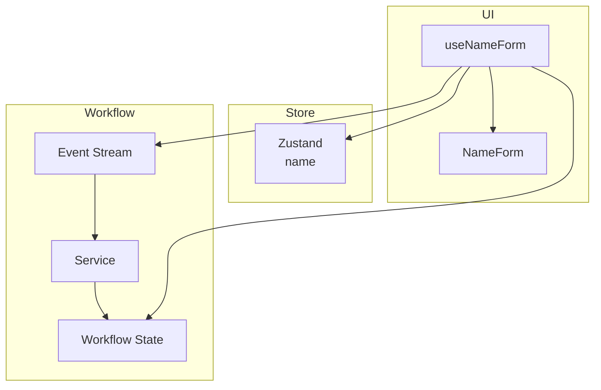

# Manage State with Zustand and Model Workflows with RxJS

The tool or tools that replace Cerebral will need to account for both:

- Traditional state access patterns like getter, setter, and derived state calculations
- Workflow orchestration of some sort

This document contains an example design of how Zustand can be used to handle state access, while workflows are modeled using a minimal RxJS pattern.

## Example Implementation using RxJS

Note: This document provides a stripped-down reference implementation to demonstrate core concepts. The code prioritizes clarity over production concerns like testing, error boundaries, etc.

```typescript
// nameFormStore.ts
import { create } from 'zustand'

type NameFormState = {
  name: string
  setName: (name: string) => void
  reset: () => void
}

const initialState = { name: '' }

export const useNameFormStore = create<NameFormState>((set) => ({
  ...initialState,
  setName: (name) => set({ name }),
  reset: () => set(() => ({ ...initialState })),
}))

// workflow.ts
import { Subject, Observable, merge, of, from } from 'rxjs'
import { switchMap, shareReplay } from 'rxjs/operators'
import { useState, useEffect } from 'react'

type FormEvent<TData> =
  | { type: 'SUBMIT'; payload: TData }
  | { type: 'RESET' };

type FormState<TData> =
  | { status: 'idle' }
  | { status: 'submitting' }
  | { status: 'success'; data: TData }
  | { status: 'error'; error: unknown };

type FormService<TData> = {
  submit: (data: TData) => Promise<void>;
};

export const createFormService = <TData>(): FormService<TData> => ({
  submit: async (data: TData) => {
    // make a network call or do some sort of async work in a try/catch block
  },
});

// RxJS-based workflow implementation
export const createWorkflow = <TData>(service: FormService<TData>) => {
  // Instantiate a `Subject` that acts as an event emitter for form events
  const eventStream = new Subject<FormEvent<TData>>();

  // `merge` combines the initial idle state with event-driven updates to create
  // a unified observable of form states
  const state$ = merge(
    // `of` emits the initial idle state immediately
    of({ status: 'idle' }),
    // `eventStream.pipe` processes events emitted by the subject
    eventStream.pipe(
      // `switchMap` cancels ongoing workflows when a new event arrives and
      // processes the latest event, preventing race conditions
      switchMap((event) => {
        if (event.type === 'RESET') {
          return of({ status: 'idle' })
        }

        if (event.type === 'SUBMIT') {
          return merge(
            of({ status: 'submitting' as const }),
            from(service.submit(event.payload))
              .pipe(
                map(result => ({
                  status: 'success' as const,
                  result
                })),
                catchError(error => of({
                  status: 'error' as const,
                  error: error instanceof Error ? error.message : 'Unknown error'
                }))
              )
          );
        }

        // fallback to idle state for unexpected events
        return of({ status: 'idle' })
      }))
    )
  ).pipe(
    // Prevent new submissions while already submitting
    filter((newState, index) => {
      if (index === 0) return true;
      return !(newState.status === 'submitting' && eventStream[index - 1]?.status === 'submitting');
    }),

    // shareReplay ensures late subscribers still receive the current state
    shareReplay({ bufferSize: 1, refCount: true })
  )

  return {
    state$, // observable of form state
    emitEvent: (event: FormEvent<TData>) => { // method to emit events
      // Prevent submission if already in success state
      if (event.type === 'SUBMIT') {
        const currentState = eventStream.value;
        if (currentState?.status === 'success') return;
      }
      eventStream.next(event);
    }

  }
}

export const useWorkflow = <TData, TEvent>(workflow: {
  state$: Observable<FormState<TData>>;
  emitEvent: (event: TEvent) => void;
}) => {
  const [workflowState, setWorkflowState] = useState<FormState<TData>>({
    status: 'idle',
  });

  // Ensures subscription is properly cleaned up to prevent memory leaks with RxJS
  useEffect(() => {
    const subscription = workflow.state$.subscribe(setWorkflowState);
    return () => subscription.unsubscribe();
  }, [workflow.state$]);

  return [workflowState, workflow.emitEvent] as const;
};

// useNameForm.ts
import { useNameFormStore } from './nameFormStore'
import { createWorkflow, useWorkflow, createFormService } from './workflow'

const useNameForm = () => {
  const { name, setName, reset: resetStore } = useNameFormStore();
  const service = createFormService<{ name: string }>();
  const workflow = createWorkflow<{ name: string }>(service);
  const [workflowState, emitEvent] = useWorkflow(workflow);

  const workflowStatus = {
    isIdle: workflowState.status === 'idle',
    isSubmitting: workflowState.status === 'submitting',
    isSuccess: workflowState.status === 'success',
    isError: workflowState.status === 'error',
    error: workflowState.status === 'error' ? workflowState.error : undefined,
  };

  // Centralized reset logic
  const handleReset = () => {
    // Perform both store reset and workflow reset atomically
    resetStore(); // reset Zustand store
    emitEvent({ type: 'RESET' }); // reset workflow state
  };

  // Organize return value into fields, actions, and status for semantic clarity
  return {
    fields: {
      name,
    },
    actions: {
      handleChange: (value: string) => setName(value),
      handleSubmit: () => emitEvent({ type: 'SUBMIT', payload: { name } }),
      handleReset,
    },
    workflowStatus,
  };
};

// NameForm.tsx
import React from 'react';
import { useNameForm } from './useNameForm';

const NameForm: React.FC = () => {
  const { fields, actions, workflowStatus } = useNameForm();

  if (workflowStatus.isError) {
    return <div>Error: {workflowStatus.error}</div>;
  }

  return (
    <form
      onSubmit={(e) => {
        e.preventDefault();
        actions.handleSubmit();
      }}
    >
      <input
        value={fields.name}
        onChange={(e) => actions.handleChange(e.target.value)}
        disabled={workflowStatus.isSubmitting}
      />
      <button
        type="submit"
        disabled={workflowStatus.isSubmitting}
      >
        {workflowStatus.isSubmitting ? 'Saving...' : 'Save'}
      </button>
      {workflowStatus.isSuccess && (
        <button onClick={actions.handleReset}>
          Add Another
        </button>
      )}
    </form>
  );
};
```

## Dependency Graph



## Key RxJS Concepts

### Operators Used

- `switchMap`: Cancels previous in-flight operations when a new event arrives. Critical for handling superseding requests like form submissions.
- `shareReplay`: Ensures shared subscription to a single source, preventing redundant emissions.
- `merge`: Combines multiple observables into one, used here to merge the initial state with subsequent updates.

### Error Handling

The implementation uses `switchMap` with try/catch to handle errors within the observable chain. This ensures errors propagate properly through the stream while maintaining type safety.

## Pros and Cons of Approach

Pros:

- Clear separation of state management and workflow orchestration
- Abstractions could be created to isolate RxJS-specific knowledge and improve developer experience
- Enables declarative approach to building workflows

Cons:

- Steep learning curve that requires familiarity with RxJS and the concept of observables and event streams
- Will become complex if workflows grow too large
- Would be overkill for simple workflows
- Debugging observables can be tricky since errors often propagate through streams in non-obvious ways
- Misuse of operators or lack of attention to unsubscribing from streams can lead to memory leaks or performance bottlenecks