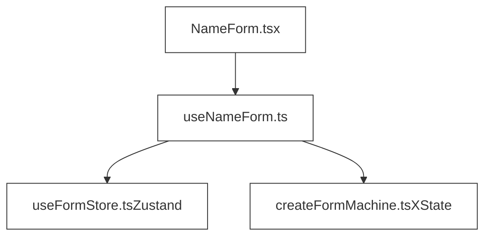

# Replacing Cerebral: Current Architecture and Alternative Approaches

## Overview

The DAWSON engineering team needs to migrate from the no-longer-maintained Cerebral state management library to some better-maintained library. This is a tricky endeavor for a number of reasons, some of which are orthogonal (i.e., they represent distinct challenges that don't necessarily intersect).

This document will:

1. Describe the circumstances that require a migration away from Cerebral.
2. Describe the challenges of migrating away from Cerebral.
3. Describe the current design of the application's frontend state management solution.
4. Analyze the characteristics of the current design.
5. Explore tools that could replace Cerebral by way of nonfunctional code.

## Technical Scope

This document focuses on state management within our single-page application (SPA) running in the browser. Server-side considerations and other system components are out of scope.

## Circumstances Requiring Migration

Several factors require moving away from Cerebral:

1. Cerebral is no longer actively maintained.
2. React 19.x, the latest major version as of December, 2024, is not supported.
3. Cerebral has poor TypeScript support.

## Challenges  of Migrating from Cerebral

There are a number of significant challenges the team will need to overcome in order to migrate off Cerebral.

1. Any React component that interacts with state in the application is wrapped in a call to the Cerebral `connect` function. This tightly couples presentational concerns with Cerebral.
2. Workflows triggered by event handlers in components that work with Cerebral state are modeled using Cerebral sequences and actions. This tightly couples business processes to Cerebral.

**Note**: Throughout this document, the unquoted terms "sequence" and "action" refer specifically to _Cerebral sequences_ and _Cerebral actions_. These are fundamental abstractions provided by Cerebral.

## Current Design

This section describes the current architectural principles for state management in DAWSON:

- All state lives in a single state tree: there is as little component-specific state as possible
- React components are strictly presentational where possible: "fancy HTML"
- Event handlers delegate to Cerebral "sequences" for all business logic
- These "sequences" comprise more granular "actions" that can be:
    - Chained together
    - Pass data along as they execute
    - Branch based on results of prior actions

### Example Implementation

Here is a simple form that demonstrates how Cerebral is used in DAWSON:

```tsx
// NameForm.tsx
import { connect } from '@web-client/presenter/shared.cerebral';
import { sequences } from '@web-client/presenter/app.cerebral';
import { state } from '@web-client/presenter/app.cerebral';
import React from 'react';

export const NameForm = connect( // #1
  {
    form: state.form,
    nameFormHelper: state.nameFormHelper,
    updateFormValueSequence: sequences.updateFormValueSequence,
    validateNameFormSequence: sequences.validateNameFormSequence,
    validationErrors: state.validationErrors,

  },
  function NameForm({
    form,
    nameFormHelper,
    updateFormValueSequence,
    validateNameFormSequence,
    validationErrors,
  }) {
    return (
      <>
        {/* #2 */}
        <span>Your current name: {nameFormHelper.formattedName}</span>
        <form
          onSubmit={e => {
            // #3
            e.preventDefault();
            validateNameFormSequence();
          }}
        >
          <input
            type="text"
            name="name"
            {/* #4 */}
            value={form.name || ''}
            onChange={e => {
              // #5
              updateFormValueSequence({
                key: e.target.name,
                value: e.target.value,
              });
            }}
          />
          {/* #6 */}
          {validationErrors.name && (
            <span className="error">{validationErrors.name}</span>
          )}
          <button type="submit">Submit</button>
        </form>
      </>
    );
  }
);
```

1. `connect` is a higher-order function that wraps and returns the component itself, which is passed as the second argument to `connect` along with a configuration object pulling in Cerebral functionality that the form needs.
2. `state.nameFormHelper` is a computed that exposes derived state values. Computeds automatically re-evaluate when their dependent state values change.
3. In the `onSubmit` event handler, sequences called on form submission.
4. DAWSON tends to use a universal `form` property on state that is dynamically reset and populated as new forms render in the UI.
5. `updateFormValueSequence` updates the `form` property on state. This sequence is reusable across components.
6. This common pattern conditionally renders a specific validation error if it exists in state.

Below is an example of what `validateNameFormSequence` might look like:

```tsx
// validateNameFormSequence.ts
import {clearAlertsAction } from '../actions/clearAlertsAction';
// ... import remaining actions

export const validateNameFormSequence = showProgressSequenceDecorator([
    clearAlertsAction,
    validateNameFormAction,
    {
        error: [setValidationErrorAction],
        success: [
            submitNameFormAction,
            navigateToPathAction,
        ],
    },
]) as unknown as () => void;
```

Note the conditional logic after the action that validates the form.

In these action functions, we set state like this:

`get(state.someProperty)`

And set state like this:

`store.set(state.someProperty, 'someValue');`

### Characteristics of Current Design

DAWSON uses Cerebral to:

1. Get and set state on a single state tree
2. Get derived and computed values based on the current state tree
3. Declaratively define workflows that are triggered by event handlers

These are the primary technical use cases we need to account for when considering how to replace Cerebral.

### Ramifications of Current Design

Each way that Cerebral satisfies the characteristics above comes with distinct advantages and limitations that inform the selection of replacement tools.

#### 1. Get and set state on a single state tree

Pros:

- Predictable state updates through a single source of truth
- Simple state debugging since all data flows through one tree
- Simple mental model

Cons:

- Complex state shape becomes difficult to maintain as application grows
- State data relevant only to a specific component could be deeply nested
in the global state tree
- TypeScript types become unwieldy for deeply nested state

#### 2. Get derived and computed values based on the current state tree

Pros:

- Automatic recalculation of derived values when dependent state changes
- Business logic stays isolated from components
- Computed values can be reused across components

Cons:

- Computed values can create hidden dependencies
- Performance overhead from unnecessary recalculations

#### 3. Orchestrate workflows triggered by event handlers

Pros:

- Clear separation between UI components and business logic
- Reusable sequences can be composed from smaller actions
- Declarative branching based on action results

Cons:

- Tight coupling to Cerebral's sequence/action model
- Complex workflows become difficult to debug
- Testing requires mocking Cerebral's infrastructure

***

## Possible Paths Forward

The tool or tools that replace Cerebral will need to account both for both:

- Traditional get/set/derive state access patterns
- Workflow orchestration of some sort

## Direct Migration to Zustand With Bespoke Workflows

This section contains an example design of how Zustand could be used to handle state access, while workflows are simply imperative functions with conditional logic.

### Example Implementation

```typescript
// nameFormStore.ts
import { create } from "zustand";

type FormState = {
  name: string;
  setName: (name: string) => void;
  resetForm: () => void;
};

export const useNameFormStore = create<FormState>((set) => ({
  name: "",
  setName: (name) => set({ name }),
  resetForm: () => set({ name: "" }),
}));
```

```typescript
// NameForm.tsx
import React from 'react';
import { useNameFormStore } from './nameFormStore';

export const NameForm: React.FC = () => {
  const { name, setName, resetForm } = useNameFormStore();

  const handleSubmit = (e: React.FormEvent) => {
    // In a practical application, the workflow logic in this
    // callback would be extracted into its own routine. The
    // event handler in this component could pass user input to
    // that routine. This would ensure that business processes
    // are modeled outside of the context of a React component.
    e.preventDefault();

    if (name.trim()) {
      alert(`Name submitted: ${name}`);
      resetForm();
    } else {
      alert('Please enter a name.');
    }
  };

  return (
    <form onSubmit={handleSubmit}>
      <input
        type="text"
        value={name}
        onChange={(e) => setName(e.target.value)}
      />
      <button type="submit">Submit</button>
    </form>
  );
};
```

### Pros and Cons of Bespoke Workflows

Pros:

- Simple mental model
- Relatively small learning curve
- Quick to implement for simple workflows

Cons:

- Loss of declarative workflow orchestration
- Manual error handling in workflows
- Potentially very difficult to implement for complex workflows

## Use Two Tools in Conjunction to Replace Cerebral

### Why Consider This Approach?

Managing workflows with state machines offers several advantages that align well with our migration needs:

1. **Declarative Workflows**: Similar to Cerebral's sequences, workflows can be defined declaratively.
2. **Type Safety**: TypeScript support.
3. **Testing**: Workflows can be tested in isolation.

### Example Implementation Using XState

```typescript
// useNameFormStore.ts
import { create } from 'zustand'

type NameFormState = {
  name: string
  setName: (name: string) => void
  reset: () => void
}

const initialState = { name: '' }

export const useFormStore = create<NameFormState>((set) => ({
  ...initialState,
  setName: (name) => set({ name }),
  reset: () => set(initialState),
}))

// createFormMachine.ts
import { createMachine } from 'xstate'

export const createFormMachine = createMachine({
  id: 'nameForm',
  initial: 'idle',
  states: {
    idle: {
      on: { SUBMIT: 'submitting' },
    },
    submitting: {
      invoke: {
        src: 'submitForm',
        onDone: 'success',
        onError: 'idle',
      },
    },
    success: {
      // Automatically transitions to 'idle' after 1 second
      after: { 1000: 'idle' },
    },
  },
})

// useNameForm.ts
import { useMachine } from '@xstate/react'
import { useFormStore } from './useFormStore'
import { createFormMachine } from './createFormMachine'

export const useNameForm = () => {
  const { name, setName, reset } = useFormStore();

  const [state, send] = useMachine(createFormMachine, {
    services: {
      submitForm: async () => {
        // Simulate async work--in practice, this should be isolated in
        // a separate service function that isolates network calls,
        // etc.
        await new Promise((resolve) => setTimeout(resolve, 500));
      },
    },
  })

  const handleChange = (value: string) => setName(value);
  const handleSubmit = () => send('SUBMIT');

  return {
    name,
    isSubmitting: state.matches('submitting'),
    isSuccess: state.matches('success'),
    handleChange,
    handleSubmit,
  }
}

// NameForm.tsx
import React from 'react'
import { useNameForm } from './useNameForm'

export const NameForm: React.FC = () => {
  const {
    name,
    isSubmitting,
    isSuccess,
    handleChange,
    handleSubmit
  } = useNameForm();

  return (
    <form
      onSubmit={(e) => {
        e.preventDefault()
        handleSubmit()
      }}
    >
      <input
        type="text"
        value={name}
        onChange={(e) => handleChange(e.target.value)}
        disabled={isSubmitting}
      />
      <button type="submit" disabled={isSubmitting}>
        {isSubmitting ? 'Submitting...' : 'Submit'}
      </button>
      {isSuccess && <div>Form submitted successfully!</div>}
    </form>
  )
}
```



### Pros and Cons of Using Two Separate Tools

Pros:

- Declarative approach is similar to Cerebral's sequences
- Workflows with a great deal of complexity are easier to build
- Isolated workflows could be unit tested independently

Cons:

- Requires designing an abstraction to isolate state management implementation details from components
- Steep learning curve requiring developer competency in two disparate tools
- Overkill for simple workflows