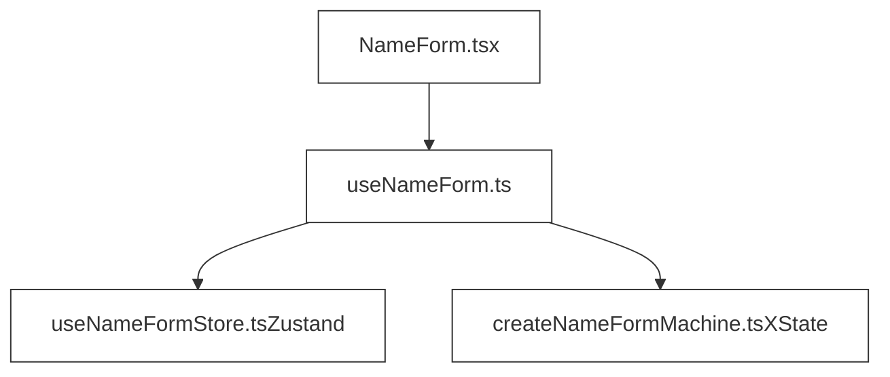

# Manage State with Zustand and Model Workflows with XState

The tool or tools that replace Cerebral will need to account for both:

- Traditional state access patterns like getter, setter, and derived state calculations
- Workflow orchestration of some sort

This document contains an example design of how Zustand could be used to handle state access, while workflows are modeled using XState.

## Example Implementation using XState

```typescript
// useNameFormStore.ts
import { create } from 'zustand'

type NameFormState = {
  name: string
  setName: (name: string) => void
  reset: () => void
}

const initialState = { name: '' }

export const useNameFormStore = create<NameFormState>((set) => ({
  ...initialState,
  setName: (name) => set({ name }),
  reset: () => set(() => ({ ...initialState })),
}))

// createFormMachine.ts
import { createMachine } from 'xstate'

export const createNameFormMachine = createMachine({
  id: 'nameForm',
  initial: 'idle',
  states: {
    idle: {
      on: { SUBMIT: 'submitting' },
    },
    submitting: {
      invoke: {
        src: 'submitForm',
        onDone: 'success',
        onError: 'idle',
      },
    },
    success: {
      // Automatically transitions to 'idle' after 1 second
      after: { 1000: 'idle' },
    },
  },
})

// useNameForm.ts
import { useMachine } from '@xstate/react'
import { useNameFormStore } from './useNameFormStore'
import { createNameFormMachine } from './createNameFormMachine'

export const useNameForm = () => {
  const { name, setName, reset } = useNameFormStore();

  const [state, send] = useMachine(createNameFormMachine, {
    services: {
      submitForm: async () => {
        // Simulate async form submission (e.g., replace with network call)
        await new Promise((resolve) => setTimeout(resolve, 500));
      },
    },
  })

  const handleChange = (value: string) => setName(value);
  const handleSubmit = () => send('SUBMIT');

  return {
    name,
    isSubmitting: state.matches('submitting'),
    isSuccess: state.matches('success'),
    handleChange,
    handleSubmit,
  }
}

// NameForm.tsx
import React from 'react'
import { useNameForm } from './useNameForm'

export const NameForm: React.FC = () => {
  const {
    name,
    isSubmitting,
    isSuccess,
    handleChange,
    handleSubmit
  } = useNameForm();

  return (
    <form
      onSubmit={(e) => {
        e.preventDefault()
        handleSubmit()
      }}
    >
      <input
        type="text"
        value={name}
        onChange={(e) => handleChange(e.target.value)}
        disabled={isSubmitting}
      />
      <button type="submit" disabled={isSubmitting}>
        {isSubmitting ? 'Submitting...' : 'Submit'}
      </button>
      {isSuccess && <div>Form submitted successfully!</div>}
    </form>
  )
}
```

## Dependency Graph



## Pros and Cons of Approach

Pros:

- Declarative approach is similar to Cerebral's sequences
- Workflows with a great deal of complexity are easier to build
- Isolated workflows could be unit tested independently

Cons:

- Requires designing an abstraction to isolate state management implementation details from components
- Steep learning curve requiring developer competency in two disparate tools
- Overkill for simple workflows
- Combining two libraries might introduce additional runtime complexity, making debugging more difficult (this could be mitigated by developing a unified abstraction layer)
