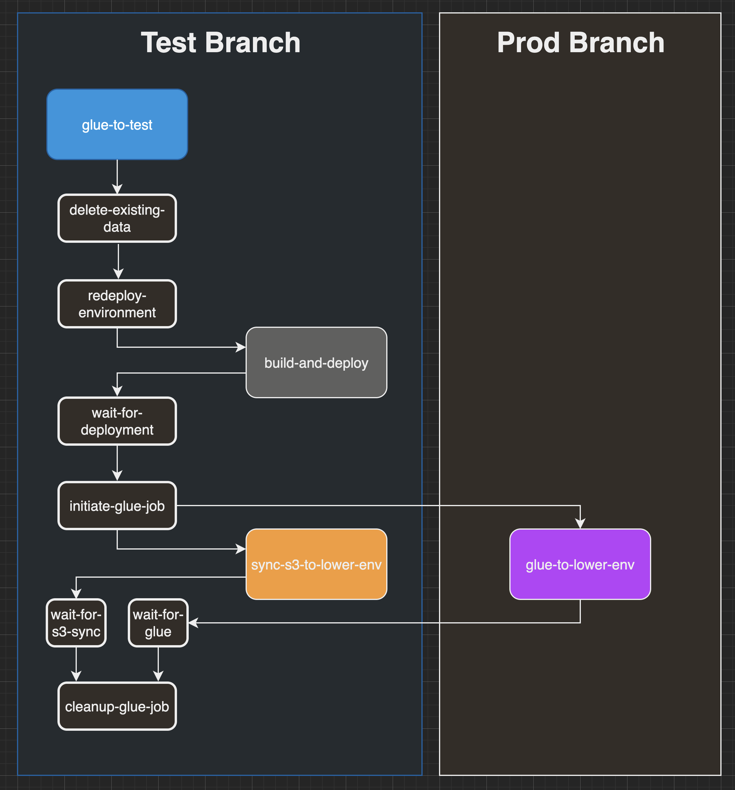

# Glue Jobs 

AWS Glue is capable of moving data from one database table to another and transforming it along the way. We use AWS Glue to copy data from the production DynamoDB table to an empty DynamoDB table in the staging account with a small transform to obfuscate email addresses.

## Running a Glue Job Manually

Follow these steps to perform a glue job manually.

1. With local environment variables pointed to the target lower environment, edit values in the `deploy` table to configure the `alpha` table as both the current and destination table and set `migration` to `false`:
   ```zsh
   . scripts/env/set-env.zsh ustc-test
   ./scripts/circleci/setup-deploy-table-for-glue-job.sh
   ```
1. Refresh your local environment variables with the new values you just wrote to the `deploy` table:
   ```zsh
   . scripts/env/set-env.zsh ustc-test
   ```
1. Delete all existing DynamoDB tables and OpenSearch clusters in the target lower environment:
   ```zsh
   ./scripts/delete-all-persistence.sh
   ```
1. Run a deployment in this lower environment to create new, empty DynamoDB tables and an empty OpenSearch cluster. The easiest way to do this is to re-run the most recent `build-and-deploy` workflow to this environment in CircleCI.
1. After the deployment completes, disable streams in the newly-created DynamoDB tables:
   ```zsh
   ./scripts/dynamo/toggle-streams.sh --off
   ```
1. In a **new terminal session** with environment variables pointed to the production environment, start the glue job:
   ```zsh
   . scripts/env/set-env.zsh ustc-prod
   LOWER_ENV=test npx ts-node --transpile-only scripts/glue/start-glue-job.ts "efcms-${LOWER_ENV}-alpha"
   ```
1. Back in the terminal session with environment variables pointed to the target lower environment, synchronize the S3 documents buckets:
   ```zsh
   aws s3 sync "s3://${PROD_DOCUMENTS_BUCKET_NAME}" "s3://${EFCMS_DOMAIN}-documents-${STAGE}-us-east-1}" --delete --region us-east-1
   ```
1. Wait for the glue job and S3 documents sync to complete before proceeding. The S3 sync will output each copy/delete operation to the terminal, so you will know when it is finished. You will need to periodically check on the glue job's status in the terminal session with environment variables pointed to the production environment:
   ```zsh
   npx ts-node --transpile-only scripts/glue/glue-job-status.ts
   ```
   Once the `JobRunState` is `SUCCEEDED`, close the terminal session:
   ```zsh
   exit
   ```
1. After the glue job and S3 documents sync are both complete, re-enable the target lower environment's DynamoDB streams so the newly-glued data will start indexing in OpenSearch:
   ```zsh
   ./scripts/dynamo/toggle-streams.sh --on
   ```

## Automated Glue Jobs

Automated glue jobs are scheduled in CircleCI and utilize a series of CircleCI workflows to execute the steps described above. Unlike the existing `build-and-deploy` workflow, which performs all of its work within a single workflow, a glue job consists of multiple separate workflows. This diagram describes these workflows, when they are executed, and the branch of the repository from which they run.



### Scheduling additional automated glue jobs in other lower environments

If in the future we want to schedule additional glue jobs in other lower environments, we can achieve this easily with minimal additional code. For example, let's say we want to schedule automated glue jobs into the `mig` environment. We will need to define a new `glue-to-mig` workflow in `.circleci/config.yml` and then define the schedule in our CircleCI project:

1. In `.circleci/config.yml`, define a new `parameter` that we can utilize to manually run our new workflow (for testing purposes):
   ```yaml
     run_glue_to_mig:
       default: false
       type: boolean
   ```
1. Elsewhere in `.circleci/config.yml`, define a new `only-mig` variable alongside the existing `only-test` variable which will ensure this workflow only runs in the `migration` branch:
   ```yaml
   only-mig: &only-mig
     filters:
       branches:
         only:
           - migration
   ```
1. Elsewhere in `.circleci/config.yml`, define a new `glue-to-mig` workflow, based on the existing `glue-to-test` workflow, replacing instances of `test` with `mig`:
   ```yaml
     glue-to-mig:
       # copy existing glue-to-test workflow and change instances of 'test' to 'mig'
   ```
1. Create a new schedule for this workflow in our CircleCI project. The `glue-to-test` workflow runs on the 1st of the month, so we'll schedule this new `glue-to-mig` workflow to run on the 2nd:
   ```zsh
   export CIRCLE_MACHINE_USER_TOKEN=<your circle user token here>
   export CIRCLE_PROJECT_SLUG=github/ustaxcourt/ef-cms
   curl --location --request POST "https://circleci.com/api/v2/project/${CIRCLE_PROJECT_SLUG}/schedule" \
     --header "circle-token: ${CIRCLE_MACHINE_USER_TOKEN}" \
     --header "Content-Type: application/json" \
     --data-raw '{
       "name": "glue-to-mig-schedule",
       "description": "Runs the glue-to-mig workflow",
       "attribution-actor": "system",
       "parameters": {
         "branch": "migration",
         "run_build_and_deploy": false
       },
       "timetable": {
         "per-hour": 1,
         "hours-of-day": [5],
         "days-of-week": [],
         "days-of-month": [2],
         "months": ["JAN", "FEB", "MAR", "APR", "MAY", "JUN", "JUL", "AUG", "SEP", "OCT", "NOV", "DEC"]
       }
     }'
   ```
